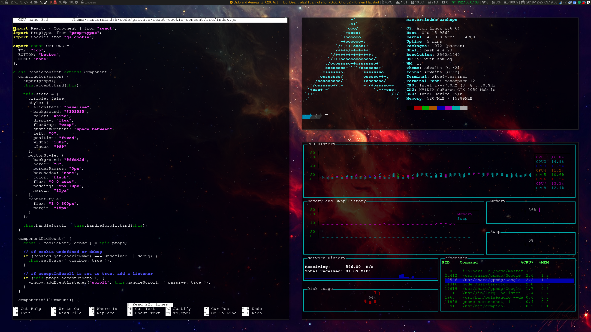

Dotfiles in Linux are a remarkable thing. Pretty much everything in Linux has a setting and most of those settings live in a config file. This is great for those using multiple computers because they don't have to fiddle with all the apps to get them "just the way I want them". No, simply include the right config file in the right spot and everything will work as expected.

Some Linux people, me included, take this to a bit of an extreme. Everything in my system uses config files to set up and without my config files I'm horribly slow at performing even basic tasks. This is one of the main reasons why I included an "install.sh" script to take me from a fresh Arch Linux install straight through to a fully set up system!

My dotfiles can be found on [GitHub](https://github.com/Mastermindzh/dotfiles).
