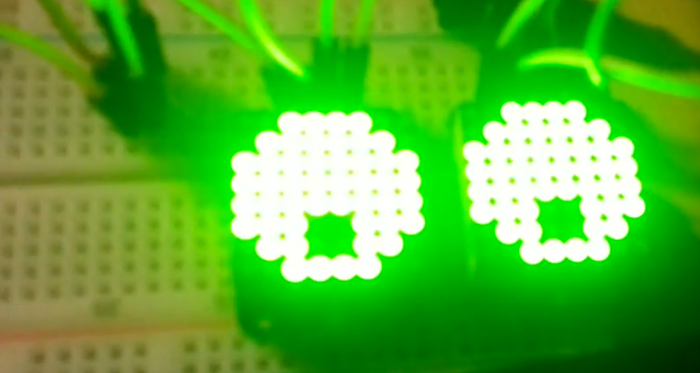

## School

In my last blog post I mentioned that I was busy with schoolwork (and all related matters like friends & gaming). That all changed yesterday, I decided not to game as much anymore and focus on something exciting again. I have no idea what kind of exciting thing I'm going to focus myself on, but most likely it will be either Arduino or Raspberry PI (cluster / solo).

Some more great news! We were able to collect 15 points (out of 60 in a year) during this first semester. And I got them all. The most difficult test for me was of course the Dutch language test. Which I barely passed. One of the other "harder" tests was a subject called "UML", and as some of you might know... I hate, most of, UML.

A new semester has started this week and we've already had a taste of what is to come. Sadly what is to come isn't all that Linux friendly. They have opted to use MsSQL instead of the (much better) MySQL(MariaDB) / PostgeSQL. This means that I, and another classmate, have to install virtualbox with Windows on our laptops. Shouldn't be a big problem should it? Well no it shouldn't. But me trying to be smart resulted in me downloading a "stripped down / light" version of Windows. (as if there is such a thing ! ha!) After setting up Windows, and installing office (since we'll be using Access (another YUK!) I tried installing MsSQL. Turns out however that one of the stripped features was powershell, and for some inexplicable reason MsSQL will **not** install without powershell. To make matters worse Microsoft decided that they wouldn't offer an install package through the website anymore since powershell is built-in in the newer versions of Windows. So I had to resort to giving up almost 30GB of hard drive space just to install MsSQL.... (and I will probably end up using MySQL anyways)

## Numix-icon-theme-square

Last night a friend of mine tried installing the Numix square theme, something that usually doesn't require my help. Last night however my friend did need some help because the theme just would **NOT** install correctly. (kept throwing a GPG key error) So after trying to install an older package (which I did not know he removed from his system) I finally decided to google the matter. Turns out the "Square" theme's actually cost money (who knew?). Turns out that Antergos Linux has some sort of a license to use them but general Linux does not.

That is why the team behind Numix has requested the package to be removed from the aur. And their request was granted. (as it should have been). Last night however we didn't have the tools handy to be able to make a purchase of the Icon theme, so I sent him my version and he installed that instead. I will however buy a license from them today, since I use the icon theme on pretty much all my machines.

## Arduino sneak peak.

I acquired some new toys for the arduino, two of them being the "Adafruit mini 8x8 LED matrix". To use them I had to install 2 libraries, and with those came "Example sketches". One of those example sketches was a "Robotic eye", naturally with me having 2 new toys I decided to create a little "face" (just eyes) with the prebuilt sketches. Anyways I thought that looked cool so I made a photo which you can view below:

