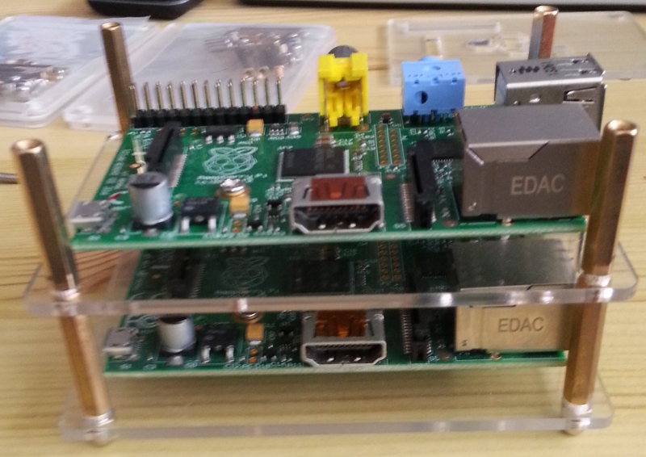
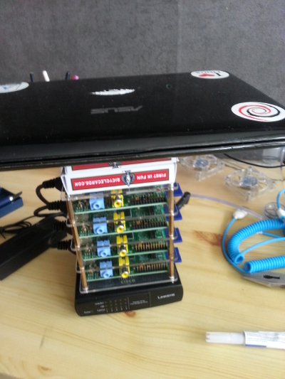
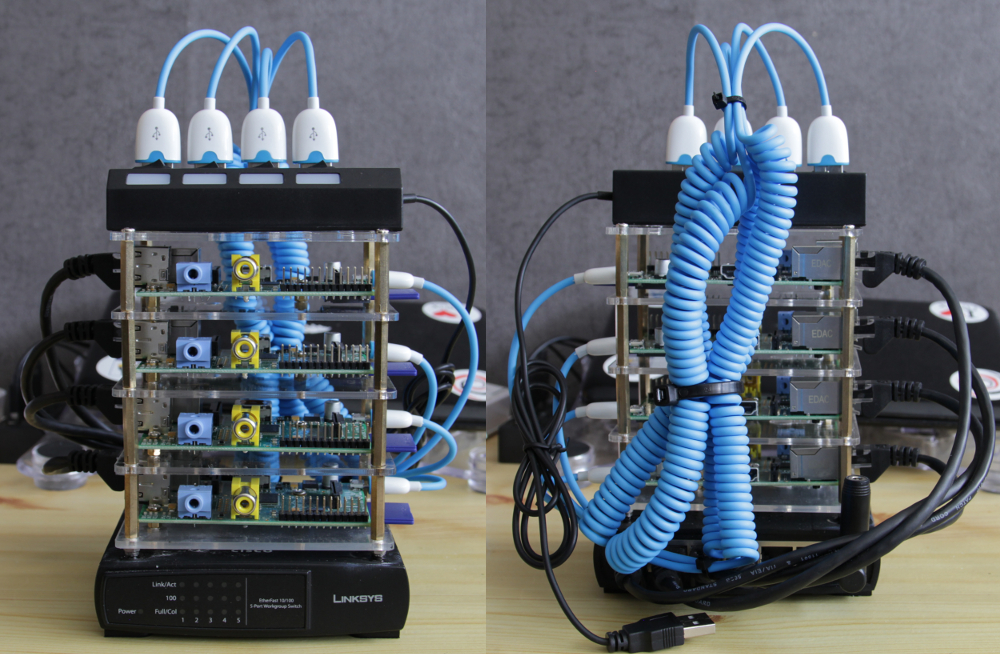

So today I finally received the required parts to finish up my Raspberry pi cluster and I was **extremely** excited! To share this excitement with you lot here's a picture of all the parts I'll be using:

I began by building the Raspberry pi "tower", sadly I forgot to take a picture with the DSLR so I only have this one cell image to show you guys:

On the picture above you can clearly see how the "tower" is being assembled.
I'm basically using the stand-offs that come included to mount the pi to the bottom plates and then instead of attaching a top plate I attach a bottom plate again. I did have to customize the plates a bit to prevent the pi's from overheating (because there now is pretty much no room between a pi and the top plate).

After mounting all 4, the "tower" now looks like this: (oh, I also added SD cards)

Then I attempted to glue the tower to my switch.... Some complications came up though. First I glued my knife to my finger and then my finger to another finger. Once I had successfully managed to glue the tower onto the switch I needed something to apply pressure to let the glue dry. Since I didn't have anything heavy handy I had to improvise. And so I did, in true nerd style:

Yes, those are 2 packs of cards (which weren't heavy enough) and an old netbook.
I went to have dinner while I let the glue dry and when I returned everything was all glued firmly into place.

After adding the cables and the usb switch I am left with my beautiful raspberry pi cluster:

In my next blog post, I will cover how to install raspbian on a raspberry pi in general and how I plan on cloning the install across all pi's
