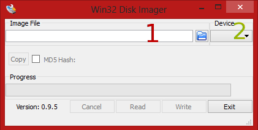

Installing an OS for a Raspberry pi is quite different from installing an OS on any other computer. We will have to write an "image" to the SD card rather than actually "installing" anything. Don't worry if you're confused just now, even I don't know what I'm rambling on about at times!

### Linux

First off, if you want to use Windows, skip this bit by clicking [here.](#windows)

First we will have to download the .img from the Raspbian website, we can do so by clicking [here](https://downloads.raspberrypi.org/raspbian_latest). After downloading the image we can use a kernel application known as "dd" to write the file to our SD card. We will first need to find out which /dev/ the SD card is currently using. To do this we can use the following command:

```bash
lsblk
```

This will show us a list of all the connected volumes. You should be able to determine which of the entries is your SD card by looking at the size of each entry. If you are not able to determine which one you need based on the size of the entry however, you can try removing the sd card and re-running the command. The entry that disappears is the SD card.

As you can see below, /dev/sde is my SD card

```bash
NAME   MAJ:MIN RM   SIZE
sda      8:0    0 119.2G
├─sda1   8:1    0   243M
├─sda2   8:2    0   7.5G
└─sda3   8:3    0 111.6G
sdb      8:16   0 111.8G
└─sdb1   8:17   0 111.8G
sdc      8:32   0 111.8G
├─sdc1   8:33   0   350M
└─sdc2   8:34   0 111.5G
sde      8:64   1   7.5G
└─sde1   8:65   1   7.5G
```

Now that we know both the input path (the downloaded iso's location) and the output path (the /dev/sd\* device) we can assemble our dd command as follows:

```bash
dd if=/path/to/iso of=/path/to/sd/card
```

When you execute the dd command the terminal will appear "busy" for the duration of the write. You can either wait patiently until it's done or check up on its status by entering the command:

```bash
sudo kill -USR1 `pidof dd`
```

### Windows

If you ended up here you have chosen to use the much inferior Windows to get Linux on your Raspberry pi's. Don't worry though, you can still install the, much superior, Linux images to your SD cards.

The very first thing we have to do is download the Raspbian image, which we can do by clicking [here](https://downloads.raspberrypi.org/raspbian_latest). After downloading the image we will have to download some software to write the image to the SD card. The tool we are going to use is called win32DiskImager, and can be downloaded free of charge [right here.](https://downloads.sourceforge.net/project/win32diskimager/Archive/Win32DiskImager-0.9.5-install.exe?r=http%3A%2F%2Fsourceforge.net%2Fprojects%2Fwin32diskimager%2F&ts=1410459796&use_mirror=cznic)

After the tool has been downloaded (and installed) we have to start it by double clicking on the .exe file, which will leave us staring at the following tool:



Using the image above as a reference:

1. This is where you have to specify the image location (you can hit the blue box to select a location)
2. Here you will have to specify which device you want to write to.

After keying in the right values you can hit "write" and wait for the "install" to finish.

## First boot

Once you boot up the pi you will get a settings screen, you can go through it if you wish. (change password and so on) If you want to start the GUI you can type:

```bash
startx
```
