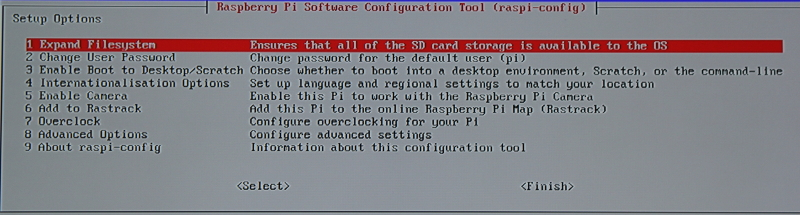
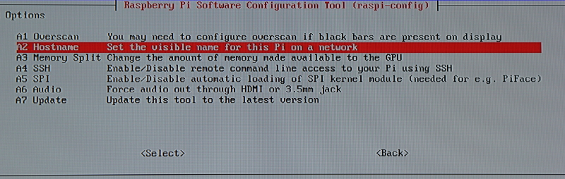

After installing raspbian to the sd card it's time to plug in that SD card and fire up the Raspberry pi. If everything went well you should end up with a screen similar to mine:



The first thing you should do is select the "Expand Filesystem" option, this will make sure the OS can access the entire SD card. After doing that you might want to change the user password (user = pi). The last thing you want to do is hidden in the "Advanced options", after going there you should see:



In here, select the "A2 Hostname" option and rename it to something better. (I appended a 0, indicating this would be the master pi)

After doing all this hit finish, reboot the pi, and log back into the shell. (default user = pi pass= raspberry) The first thing we are going to do is update the pi, in case any updates have come out since the image was uploaded to raspbian.net. We can update the pi by running the following commands:

```bash
sudo apt-get update && sudo apt-get upgrade
```

After updating the pi we need to give the pi a static ip address (so we can find it later). We can do this by following a couple of steps:

1. sudo nano /etc/network/interfaces
2. replace `iface eth0 inet dhcp` with `iface eth0 inet static`
3. Directly underneath add the following lines: (remember to change info if required)

   ```bash
   address 192.168.1.11
   netmask 255.255.255.0
   network 192.168.1.1
   broadcast 192.168.1.255
   gateway 192.168.1.1
   ```

4. Hit ctrl + x to close nano and hit y to save the changes.
5. reboot the pi

After that we have to install some required software, we can do so with the following command:

```bash
sudo apt-get install gfortran
```

After installing some of the required software we still have to install "mpich3", do so by running the following commands:

```bash
mkdir /home/pi/mpich3
cd mpich3
wget https://www.mpich.org/static/downloads/3.0.4/mpich-3.0.4.tar.gz
tar xzf mpich-3.0.4.tar.gz
sudo mkdir -p /home/rpimpi/mpich3-install
sudo mkdir -p /home/pi/mpich_build
cd /home/pi/mpich_build
sudo /home/pi/mpich3/mpich-3.0.4/configure -prefix=/home/rpimpi/mpich3-install
sudo make && sudo make install
```

After installing mpich3 we need to edit a file. Execute the following command:

```bash
sudo nano /home/pi/.profile
```

Scroll down all the way and add the following text:

```bash
PATH="$PATH:/home/rpimpi/mpich3-install/bin"
```

After adding that line hit ctrl + x and save your work. Then either restart the shell or reboot the pi.

After you have rebooted the pi you have to create a so-called "machine file", we will store this file in the folder "mpi_scripts" in our home directory. To do this execute the following commands:

```bash
mkdir ~/mpi_scripts
cd ~/mpi_scripts
echo `/sbin/ifconfig eth0 | grep "inet addr" | awk -F: '{print $2}' | awk '{print $1}'` > machinefile
```

The last command creates the machinefile and populates it with the ip of this (master) node automatically. With all of this setup we can do our first real test with the mpi commands, so try out the following command:

```bash
mpiexec -f machinefile -n 1 hostname
```

The -f is the filename parameter (so you would type the machinefile path behind that).
The -n is the number of nodes we want to use (we are working from 1 now). And finally "hostname" is the command.

if all went well you should now see the hostname of the raspberry pi (for me: raspberrypi0). After this we are done setting up the master (for now) and can begin copying the SD card. To shutdown the pi you can execute the following command:

```bash
sudo shutdown -h now
```
