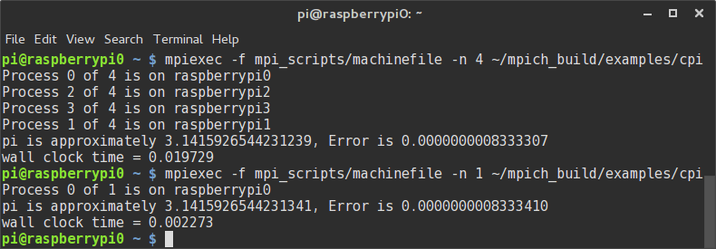

In today's post we'll have a look at expanding the cluster with more nodes! We will have a look at how to clone them and how we can set up a universal login using ssh keys.

Windows users can use the "read" option of the previously installed `win32imager` to create an img.

## Linux

Insert the tested and configured SD card and use lsblk to find out on which /dev/ the SD card resides. Now use dd to make an img of your Raspberry pi master node (note! this can be used as a backup too) with the following command:

```bash
sudo dd if=/path/to/sd/card of=/home/`whoami`/raspy.img
```

After running that command you will have an image of the configured Raspberry pi in your home folder. You will now have to write this image to all SD cards.

After writing all the images to the SD cards you have to change the hostname on all "copies". To do this put the SD card into one of the pi's, let it boot , and log in. Then give it the following command:

```bash
sudo raspi-config
```

Next, you'll have to change the ip on each of the nodes by changing the "address" line after executing the following command:

```bash
sudo nano /etc/network/interfaces
```

After setting up all 4 pi's and plugging it all in you should see all 4 led's light up on the pi's. If this is not the case you might've forgotten to change either the ip address or the hostname. (which will lead to a conflict resulting in one of them not having internet access). Mine now looks like this (note the dramatic night picture taken at 10 past 12 am):


## Logging in to the nodes with ssh keys

To make working with the cluster **a lot** easier we will use ssh keys to login in place of the old password. We are going to generate the master node's key first, to do this enter the following command.

```bash
ssh-keygen -t rsa  -C "pi@raspberrypi0"
```

You'll be asked where you want to save the key, the default directory is usually fine. After that you will be asked to enter a passphrase. (the passphrase is optional but also recommended in a production environment) After generating the key a "randomart" image will appear. After generating the key you want to execute the following command:

```bash
cat ~/.ssh/id_rsa.pub | ssh pi@192.168.1.8 "mkdir .ssh;cat >> .ssh/authorized_keys"
```

Keep in mind you might have to change the ip address in the previous command. After executing this command for the 2nd node, repeat for the third,fourth,fifth, etc., etc. nodes.

After we have copied the key to all nodes we have to edit the previously created machine file (on master) to include all the ip addresses of the other pi's. To do this type in the following command:

```bash
nano mpi_scripts/machinefile
```

Simply add all the other pi's ip addresses to the file (each on a new line).

## Testing

Now that we've added the pi's ip's to the machinefile we can use them from our master node. To test this we can run the following command:

```bash
mpiexec -f mpi_scripts/machinefile -n 4 hostname
```

This should give you 4 hostnames. If it does you've set it all up correctly! We can even try and run some C code with them by running the next command:

```bash
mpiexec -f mpi_scripts/machinefile -n 4 ~/mpich_build/examples/cpi
```



If you have a look at the screenshot above you'll see that the cluster as a whole (4 pi's) actually take longer to calulcate pi than a single node would. This is to be expected with something that runs this quickly. The cluster has to communicate with each of the pi's, which results in a tiny little bit of network overhead. In the case of calculating pi this network overhead turns out to be greater than the time it takes to calculate pi to 15 digits.

Now that we have a complete (working) cluster we are all set to start using it! But first, here's a video of me power cycling the cluster:

<iframe src="//www.youtube.com/embed/lm1oeS1uzY8" allowfullscreen="" width="420" height="315" frameborder="0"></iframe>
