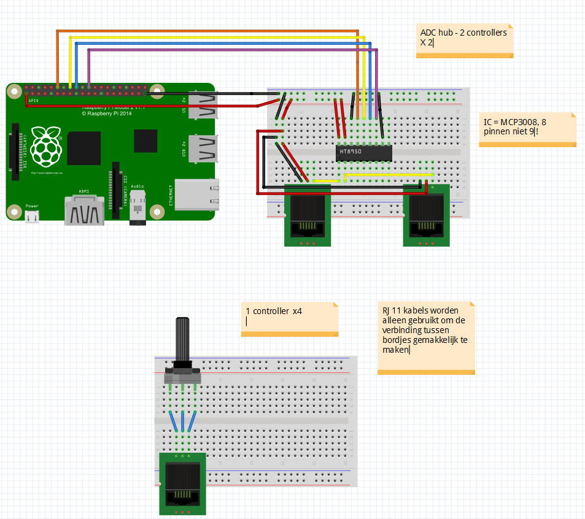
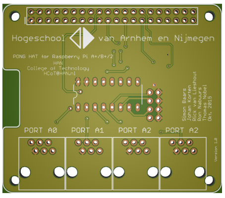
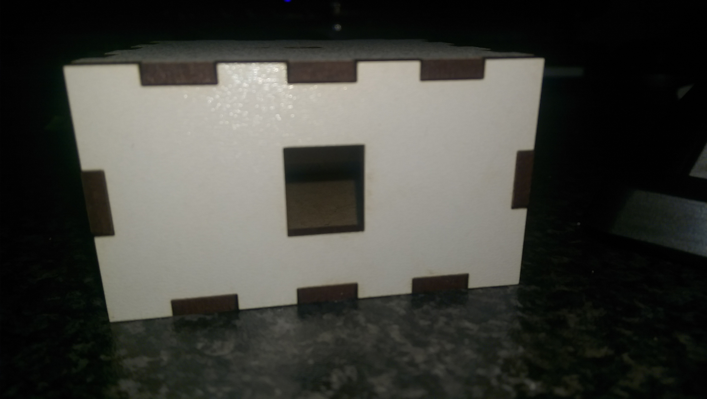
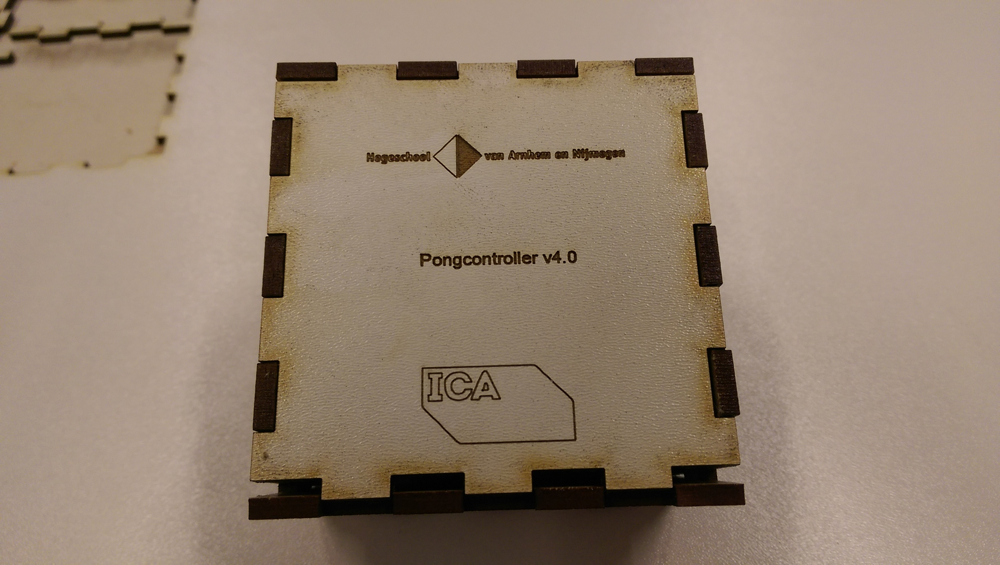
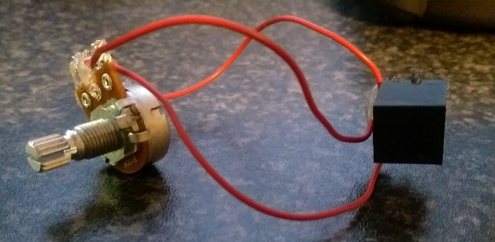
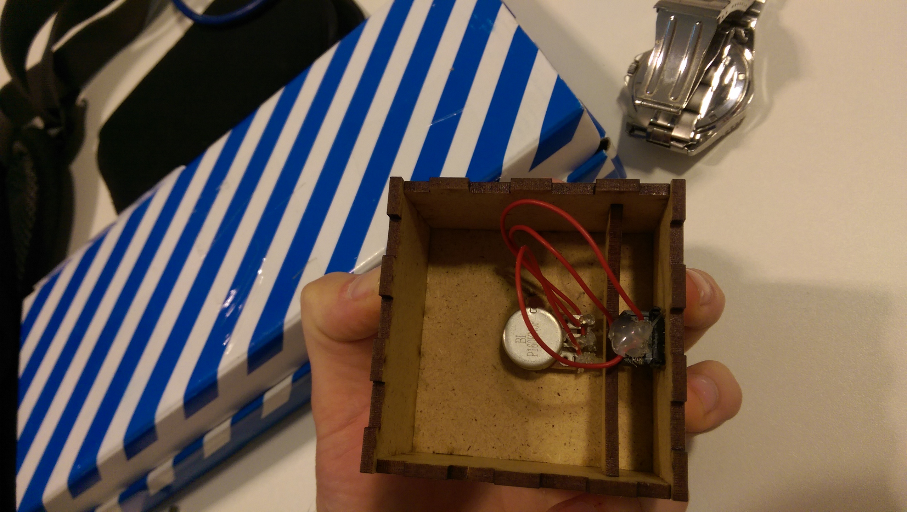
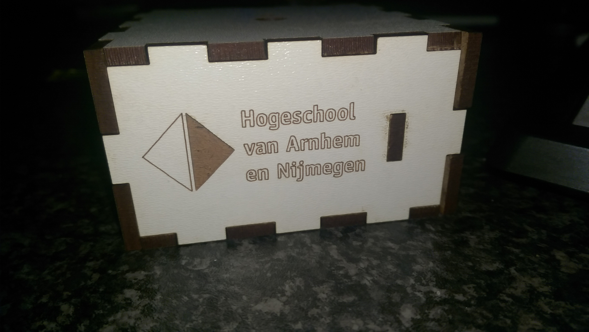
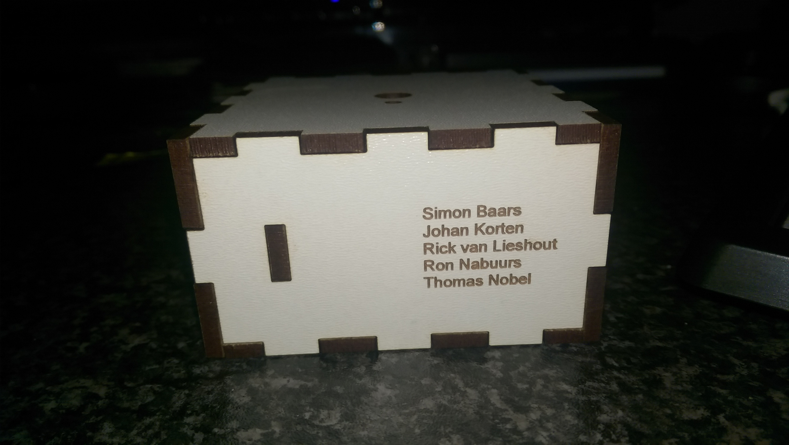
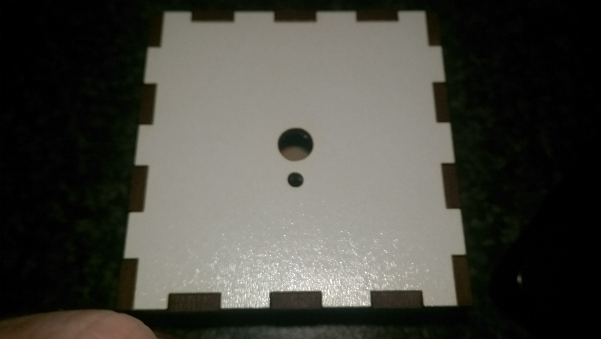

Even though this week has been extremely busy I wanted to bring you guys a little blog because the things I've been doing are truly wicked.

## Special assignment

Let's start with the boring, non maker, stuff. Around 1 pm I received a frantic phone call and a couple of messages from different people about "something". When I finally got around to dealing with them I discovered something truly awesome.

As some of you know, next semester I will be working on a (school issued) project. This usually involves a group of 4-5 students working on a single big task for about 8 weeks. This time however it will be slightly different, me and 4 other students have been asked to work on a different project than all the other students. Turns out we have been recommended by our teachers and this company, of which we do not know the name yet, has decided to give it a go.

We do not yet know what this special assignment will entail but one thing we know for sure. WE ARE EXCITED ABOUT IT !

## Maker thingies

Even though I love software development, deep down I am also still a maker. And a maker likes to "make" things (go figure...), so when I got asked to do a project involving a Raspberry Pi I couldn't refuse. Even though I had no idea what exactly the project was going to entail I enlisted anyways.

Soon after I had my first meeting with the team and the supervisor, and before long the goal of the project became clear. We were responsible for designing a workshop involving the Raspberry Pi for kids between the age of 12 and 18 years(middle school basically). One of the things we have to do is compare the Raspberry Pi to several other educational boards. This is especially important because schools don't tend to get anywhere near sufficient resources to even teach programming / IT related stuff, let alone spend their money on fun stuff like a Raspberry pi.

So we came up with "pong". We are going to create simple controllers (based on potentiometers) and some kind of Raspberry Pi hat to which we can connect them. Besides pong we also speculated about creating our own Raspberry Pi image. I quickly pointed out however that maintaining an image shouldn't be high on our priority lists and that we might have to think about a different way to solve this problem. What we eventually decided upon was an "Install" script which can be run by either the teacher or some kind of maintainer which will install all dependencies and some example sketches.

## The code

Throughout the entire project we will be using a [github repo](https://github.com/Mastermindzh/han4pi) to sync changes. One of the benefits of a github repo, apart from the actual git stuff, is that we automatically share all our code / designs. This means that anyone who is interested can either reproduce or follow along with us.

## Enough talking, show us something

Well alright then, we've got a couple of things "ready" to show others. The first of which are the design schematics of our controllers and our "hubs".

We quickly decided upon changing the hub design to a more elegant "hat" (hat being a board you can attach to the Raspberry Pi, not the fedora kind). A render of one such hats can be found below.

We also started working on the controllers. The final design will be compromised of a few "boxes" between which telephone wires run to connect them together. My fantastic soldering / glueing job on the inner workings of a controller and the laser cutted wooden box can be found below.

## The laser cutting process

For those interested in the laser cutting process I have also prepared a video:

<iframe src="https://www.youtube.com/embed/OO6UDl8CU4s?wmode=transparent" width="320" height="180"></iframe>

## The end

Well that's all for today folks, I'll keep you updated!
