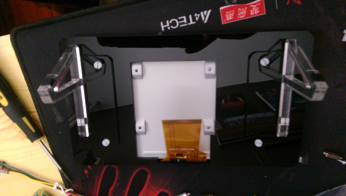

Hey guys, as some of you know I was really, and I mean **really**, excited when they announced the official raspberry pi screen. Now why is that might you ask? Everything the raspberry pi people have released so far has been really solid. The boards, the sd cards, the wifi-dongle, all of them work absolutely fantastic! So as soon as I saw that the official screen was available for pre-order in the UK I ordered myself one and started waiting.

## What's in the box?

First up is the box itself:

The box resembles the original packaging from a standalone raspberry pi which is a nice little touch. The picture on the box does not however resemble the pi screen at all which I personally kinda like but it could possibly be seen as false advertisement.

As soon as I opened the box I found a little booklet which contained some health and safety regulations. I have not taken a picture of the booklet because.... well it's a booklet....

Lifting the first bit of red foam reveals yet another piece of red foam in which several electronic bits are embedded. I did take a picture this time:

From top left to bottom right we've got:

1. 4 silver stand-offs
2. The logic board for both touch and display
3. Flat ribbon cable to connect the logic board to the pi
4. 4 cables to (optionally) connect the pi to the logic board. (more on this later)

After carefully extracting all the components I yanked out the red foam and found what I was really looking for. The official pi screen nicely protected in bubble wrap (the **only** way a display should be packaged).

![[picture of the screen in bubble wrap]](./media/screen.jpg "finally! A screen.")

After emptying the box I laid out all the pieces and checked whether my set was complete. (it was) In the picture below you'll see all the contents of the original raspberry pi 7" touchscreen laying next to a raspberry pi B v2\. Looking good so far !

Assembly was easy and straightforward. The only thing I struggled with was the stand-offs. The stand-offs connect the board directly to the metal back of the screen, something which would fry an ordinary pc motherboard. Instead of monkeying around (like usual) I decided to seek guidance and googled a bit. Being one of the early adopters comes at a price though. There was hardly any information on the screen, let alone assembly instructions. I'm sure that by the time I upload this post there is plenty of information about this particular subject but in case you are interested. Yes. You **do** screw the pi directly into the back of the screen with the included standoff screws.

## My case

I bought my pi at Pimoroni and I ordered the case/stand there as well. The exact case I ordered is [here](https://shop.pimoroni.com/products/raspberry-pi-7-touchscreen-display-frame). The case is a laser cut layer based case. This means the individual parts of the case are actually flimsy but all bolted together it forms a nice solid block. After applying the case to my screen it looked like this:

As you can see there is plenty of room for the logic board and the flat cable is dangling freely. One fun thing to note are those plastic screws (which over tighten and break easily, hence why they included a spare screw).

## Attaching the pi

The pi itself is connected to the logic board by screwing it onto the stand-offs. Quick tip: connect both ribbon cables before you connect the pi! After attaching the pi I ended up with the following result:

The red and black cables provide power (and ground) to the pi from the logic board. This means that you can power the entire thing (pi + screen) with a single micro USB cable. Neat for those that don't have a spare micro USB cable. You could also connect the pi with an ordinary micro USB cable to the logic board since it has a USB port. Connecting the pi separately might be required to use some high power GPIO peripherals.

## Booting it up

The moment had arrived, I plugged the pi into a battery pack (creating a makeshift tablet-like device) and waited. First boot wasn't all that promising... Touch didn't work and I had an annoying little square in the top right. This was however not my first rodeo with a pi and I quickly worked out that the little square indicates insufficient input power. I did a quick update and after rebooting touch worked wonders! The only thing my makeshift tablet test was missing was some sort of input method for the keyboard. For this I used a program called "matchbox", which was available in the default repository. After playing around with touch for a bit I switched to a solid 2 amp power supply and the little, coloured square disappeared, as suspected.

## That's nice and all... But we want a video...

Of course I prepared a little video, wouldn't be a showcase if I hadn't now would it. So here goes:

<iframe src="https://www.youtube.com/embed/tSR9aql7HCY?wmode=transparent" width="560" height="235"></iframe>

## In closing

So, conclusion time. I really like the pi screen, I have been using it for a while now (hence the delayed release of this blog.) and it hasn't failed me yet. The screen is solid and bright enough for my use case and the touch works wonders. The price point is a little high (88 euro's) but I suspect the price to go down quite a bit when it becomes available in stores in the Netherlands. That's it for today's blog and I'll see you all later !
