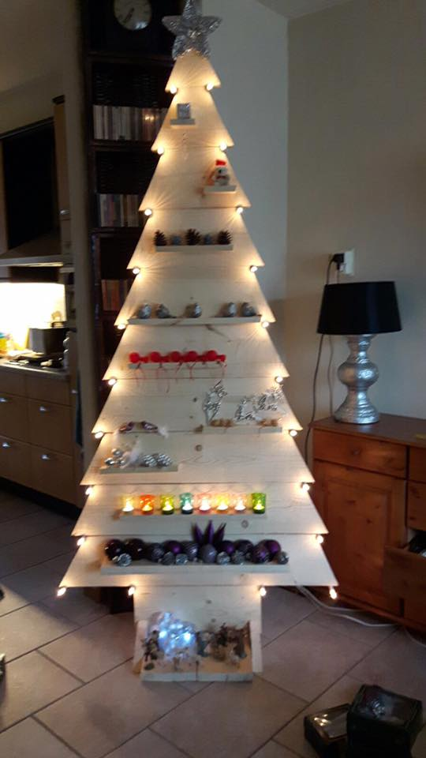
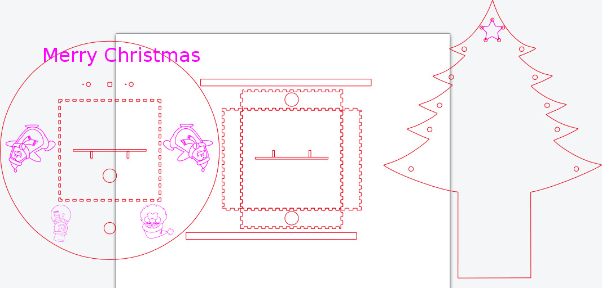

I'm very excited to announce a new maker project to you guys ! It will be simple, and thus reproducible, yet fun and quite possibly even useful. (oh, and a tad crazy)

## So? What is it?

Well.... basically I'm going to assemble and program a little christmas tree thing.

I got the idea after my parents put up their christmas tree. My mom opted for a more "modern" (so I've been told) kind of tree. This "modern" tree is basically a home made christmastree-y looking thing bolted together with a few screws. (picture below) At first I didn't like the idea of a more modern, less authentic, christmas tree but once it was actually up it didn't look half bad. There were some things missing though. It just didn't make sense to me to create something new yet be limited by old stuff. For example: my parents put a string of lights **around** the wooden boards, why not integrate them? Or why not add a dimmer? Or make it follow some flashy patterns? As you might expect by now I am basically going to recreate, with a bit more finesse, my parent's christmas tree.

## Open source?

Of course! All code will be open source! All other stuff (drawings etc.) will also be opened up to the public. Everything can be found on [Github](https://github.com/Mastermindzh/TekTree) once again.

## Step 1 - Design

I've thought long and hard about what kind of "controller" I wanted to use. And of course I immediately wanted to use a Raspberry pi. But I asked myself, why a pi? Why not use something simpler (like an arduino) to control the lights and switches. After some serious brainstorming I decided to go with an arduino in the end. I figured the Raspberry pi zero would be too cumbersome to work with for a simple christmas tree. Besides, I have a lot more uses for a pi zero than I have for an arduino, and I got more arduino's laying around than pi zero's at the moment.

## Digital drawing

After deciding to use an arduino I had another big decision to make. Should I follow my parents' example? Or go a different route? In the end I decided my way was better (kids...) and so I decided to laser cut my wooden designs. One of the other big changes I made is to the base. Whereas my parents opted for something rugged I'm going for a slightly more "finished" look. This means that my base is nice and round with a few fun shapes on it and I even speculated about making the circle sit flush with the ground.(which would mean creating bendable wood! A challenge in and of itself.)

After that came my struggle with the drawing software. I tried creating a drawing in Coreldraw Pro.... that was... a painful experience to say the least. Then I tried drawing with a program called InkScape, while better it still didn't yield any results. Finally I decided to give up and ask for help from a friend.

Luckily my friend [Ron Nabuurs](https://www.ronnabuurs.nl) is brilliant when it comes to designing a drawing which can be lasercut. So after explaining my idea to [Ron](https://www.ronnabuurs.nl) he decided to help me out. A picture of what we ended up with can be found below. The source file we used can be found on git.

## So what now ?

Well.... now I have to actually laser cut the pieces and assemble the tree. If we haven't made any mistakes (or I conveniently forget to mention them to you guys) I should be able to put out another blog this weekend showing you guys both the laser cutting and a test build of the TekTree.
