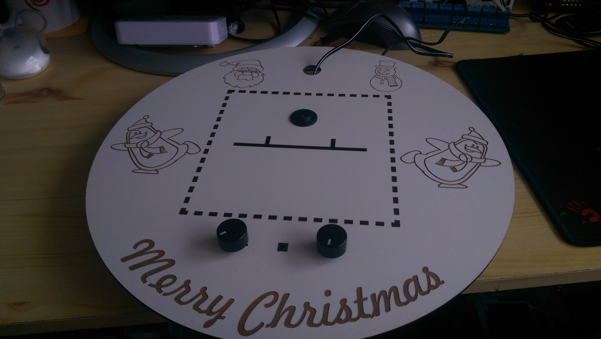

Last friday I actually got to cut the parts for my TekTree! So excited! This is by far the biggest "piece" I have ever laser cut but luckily everything went well. This in part is thanks to my brilliant friend [Ron](http://www.ronnabuurs.nl) who helped me create the sketches for the laser cutter. Thanks again [Ron](http://www.ronnabuurs.nl)!

**Top tip!** You don't have to laser cut the designs. Just print the designs with a regular printer and stick it on some wood. Then just use something like a bandsaw to cut the pieces!

## Laser cutting video

I've gotten so much positive feedback on my last laser cutting video that I decided to make another one. This one is a little different though. It's a compilation of a few different cuts.

<iframe width="560" height="235" src="https://www.youtube.com/embed/92aTol52q8o?wmode=transparant" frameborder="0" allowfullscreen></iframe>

## TekTree assembly

Below you'll find a series of pictures I took while assembling the TekTree.

