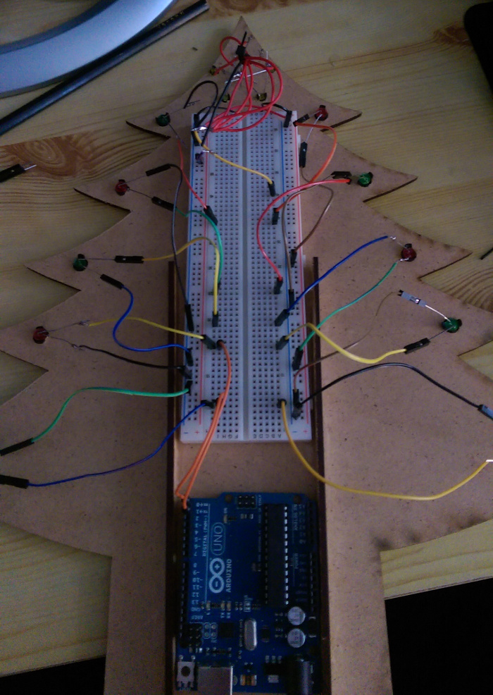
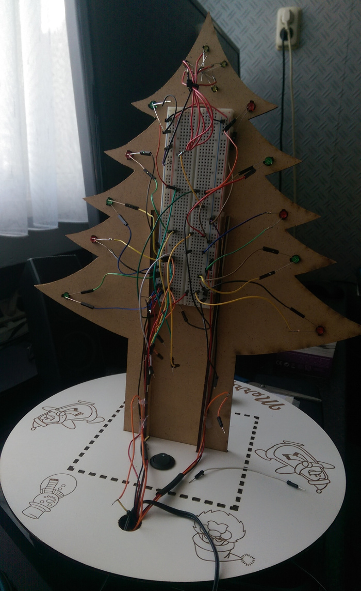

In the 3rd part of my TekTree project I'll show you guys how to wire everything. This time I even used separate colours for the power,ground and signal wires. So no more complaining ! ^\_^ All in all I think the result looks absolutely wicked. Even without the arduino case which has yet to come in the mail. (and probably won't fit)

## Wiring part 1 - schematics

Before I started to jam wires in every nook and cranny I could find I had to come up with a plan. Most of that plan has been put into a "Fritzing" sketch which can be found below and on [Github](https://github.com/Mastermindzh/TekTree). The only thing I couldn't figure out how to model on fritzing is the actual christmas tree and the power cord for the arduino.

The arduino will get power from a regular adaptor. The only modification I did to the adapter is putting a button on one of the wires. And the only reason I did that is because I'm too lazy to unplug the TekTree when I want to turn it off :)

## Why so many wires?

I want the project to be "manageable" for everyone. To do this I kept the wiring as simple as possible. Every LED has 2 prongs, 1 goes to ground 1 goes to the arduino. Simple. Same goes for the potentiometers, 3 legs, 1 power 1 ground 1 signal. The only led's I did bundle together (in terms of wiring) is the star. I did this to create a single star instead of multiple led's.

## Well you could've made it way prettier... and

Well yes, as all of us know I'm perfectly capable of designing a [refined build](/images/blogs/han4pi/Front_thumb.png). I didn't want to go with a pcb this time however because that would make the barrier to entry way higher on this project. And that is something I definitely **don't** want.

I also didn't "group" all my ground wires together. (led -> led -> led -> board) This would've made the project a lot neater but it wouldn't be anywhere near as service friendly. (which was kinda the idea...)

Well then, I feel like I prepared you guys enough to show the (complicated looking, but very simple) wiring. Check it out below!

## Wiring part 2 - Actual wiring

Below you'll find the pictures I took while I was wiring the TekTree.

