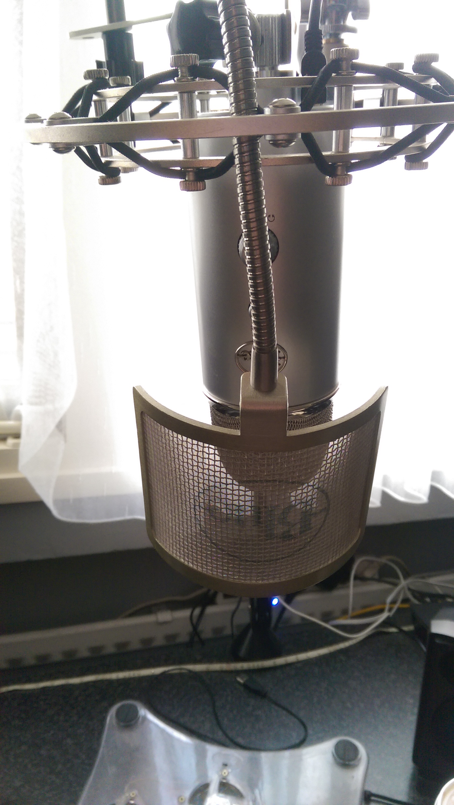
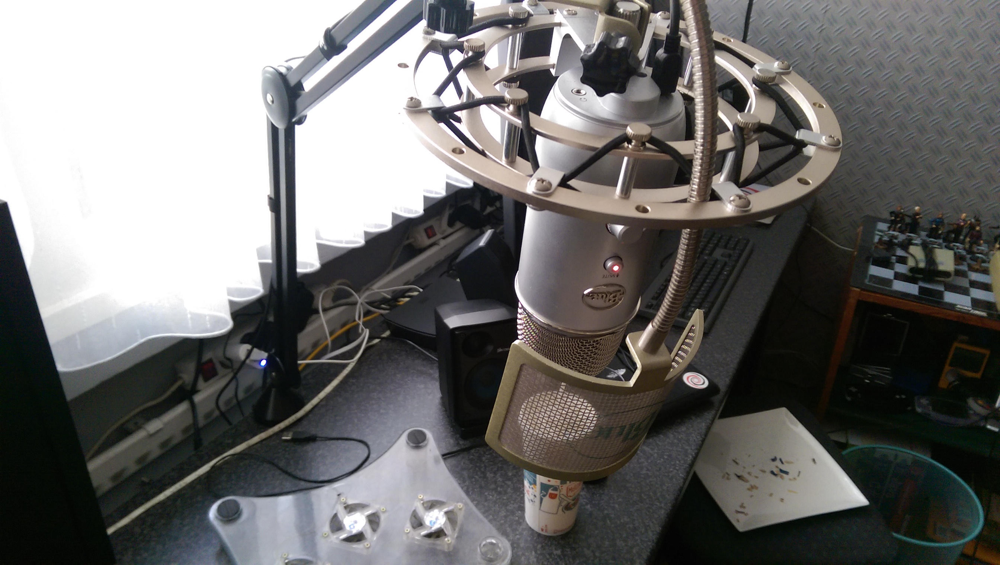

## My goals....

Last blog we talked about a couple of goals I set for myself. As usual, not all of these have been completed. But instead of focusing on the ones I didn't complete I'll focus on the ones I did.

### Finish separating my websites

I'm almost done with this goal. The content has been separated but the new portfolio isn't up yet. I hope to be uploading the new portfolio at the same time as this blog but I can't be sure of that. I can start uploading the portfolio as soon as I have finished updating a couple of "projects" under the school category. After that the portfolio will be filled with recent work and fully functional. (and quite possibly even pretty).

### Clean all my servers (both soft and hardware)

I went above and beyond on this one. I even cleaned my regular pc (soft + hard) and my laptop (soft only). Cleaning my regular (dev) pc wasn't by choice however. A lightning strike wiped out some electrical stuff and one of the things that got fried was my motherboard. While replacing my motherboard I decided to clean the entire pc since it was open already. After installing a new motherboard I had thought I would have to reinstall Windows. This however was not the case! Windows 8 and Windows 10 both successfully booted after changing my motherboard! This is the first time I have seen any Windows version do that and I was happy to see they've improved. I still decided to wipe the system however and replace the ssd Windows was on. A couple of days later I also wiped the linux sdd and replaced that with my old Windows ssd (which was purchased later and thus much faster).

As far as servers go.... I have cleaned them too ! Not only have I cleaned all my servers I have also cleaned up both my Dropbox and my Google Drive folders.

### Finish my portfolio

I kinda made this goal.... kinda. Hear me out on this one ! When I wrote my last blog post I had an idea in mind for the portfolio. There was already a sorting mechanism in place and things didn't look half bad either. However.... I decided to change things around and use a different sorting mechanism (mixitup) and also revamped the look of the portfolio. /images/videos are now the first thing you'll get to see and they will be as wide as the page itself. (some videos , like app showcases, will have black borders though). Directly beneath the media content is the customer and designer information and below that you'll find a short detailed summary for each aspect of the project. So I decided to chalk this one up as a success because I've done more work than I had originally anticipated :).

### The other goals

Only a few of the goals I had set I haven't reached. I have given up on losing weight and because of the extra portfolio work I didn't really start LSR either. 5 new tutorials is a detable goal. I haven't exactly written 5 tutorials but I have done some work on mi-soft.nl (and still wrote 2 tutorials). And 1 blogpost.... well I'm trying !

## Losing some of my stuff!

As I mentioned before I have lost some of my hardware to a lightning strike. I didn't just lose my motherboard however. I also lost my microphone (blue snowball), my keyboard (razer blackwidow), my xbox controller receiver, 8gb's of ram and some random usb peripherals. Some of the stuff was insured and thus I have gotten some money for it. However I did not simply want to replace the lost stuff, I wanted to upgrade too.

I upgraded my keyboard to a ducky shine with black cherry mx switches. I have to say I'm still getting used to the linear-ness of the switches but so far so good. The big upgrade however is my recording setup. I went from having a single blue snowball to a blue yeti with shock mount, pop filter and boom arm. Initial tests prove to be very promising and there is a definite upgrade in sound quality. Aside from sounding a bit better it looks A LOT better. It almost look's pro! Here, have a look:

## Youtube channel split + new intros and outros

Mi-Soft.nl and Rick van Lieshout are now 2 separate Youtube channels. Mi-Soft.nl will only be used to host tutorials. Nothing else. My personal channel (Rick van Lieshout) will host all other things.

I have designed a new outro for all of the Mi-Soft.nl video's. I made the outro with "Camtasia studio" and "Gimp". The outro can be found here:

<iframe src="https://www.youtube.com/embed/mysCUZzfeC4?wmode=transparent" width="320" height="180"></iframe>

I also bought some intro's from Flixpress. Both of these can be found here:

<iframe src="https://www.youtube.com/embed/AZZ86IPX9QQ?wmode=transparent" width="320" height="180"></iframe>

<iframe src="https://www.youtube.com/embed/WT5EC6UKoHQ?wmode=transparent" width="320" height="180"></iframe>

