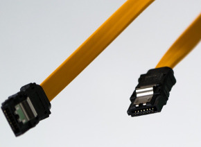

Servers.... Both a joy and a pain. This week my server has just been a pain though.... What should've been a relaxing night with some easy peasy hard drive replacements quickly turned into hours of downtime and lots of yelling and screaming :(

During my holiday stay (at [Tropical Islands](https://www.tropical-islands.de) in Germany, pictures can be found [here](https://goo.gl/photos/uSCW7ciDUZtCdXY46)), I decided I'd replace the last 3 500 GB drives in my server array (don't ask me why I was thinking about my server on holiday). So, as soon as I got home, I decided to look around and order some of those beautiful WD Red drives. I considered upgrading my parity drive as well, but I'd have to buy 3 TB models and that seemed like more of a hassle than I was willing to take on at the moment. (I should have.)

So, the drives arrived, I ran a quick benchmark followed by a quick drive test and all seemed fine with the first drive. At this point, I decide to open up the server and replace the first 500 GB hard drive. After a lot of gymnastics (trying to read drive labels while the drives are in the drive bays) I finally figured out which drive I should replace and I went to work on that drive. I was careful not to touch any of the other cables to avoid accidentally unplugging them and I thought I had done a good job. I remember thinking: "Drive replaced, cables still connected, not much hassle so far. Let's turn it on". And so I did.

## Prepare for trouble...

My good mood was rudely interrupted by a loud beep followed by three, rapid, beeps. At first, I thought it was the regular old "fan not spinning" error (I use several ways to limit fan speed) but on further inspection, I realised that the fan was spinning just fine. Things were about to turn bad....

The drive I had inserted was fine, the OS picked it up and it was performing well. One of the other drives had failed though... So I shut it back down, reconnected the old drive (the one I replaced) and replaced the failing drive with a brand new one. A parity sync is necessary at this point.. Sigh..

After replacing the "failed" drive and letting the machine run for a while I got an email from my server, emails from my server are usually bad, stating that a drive had failed. At first, I was going to dismiss it as I had just replaced one and figured the email was simply delayed. Upon closer inspection, I found out that another hard drive had failed! So I logged back into the server and inspected the problem. The new drive had failed... even though it previously passed my tests with flying colours!

Something was up... and after countless hours of fighting with my server I finally figured it out. The SATA port on the controller was faulty. It didn't error, it didn't smoke, it looked fine. It even held on to the cable just fine (cause of those tiny little lips on SATA cables) so it was kinda hard to find out that the SATA port was faulty.

So, with a way to reproducibly "fail" known good drives it was just a matter of plugging the SATA cable into another port and go on with my day.... or so I thought....

Little did I know that my server had used up all its SATA ports! I didn't have a single one left! In the end, I had to go out, pay way too much for a raid card that I didn't need and work on the server till dawn in order to fix my mistakes.

Please don't make the same mistake... make sure you have a replacement SATA port (or raid card for that matter).

Live and Learn I guess, Live. And. Learn.
