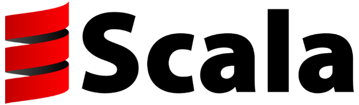

One of the final assignments for a school course called "APP" (Algorithms Programming language & Paradigms) was/is to learn a new programming language using the book "[Seven languages in Seven weeks](https://pragprog.com/search/?q=seven-languages-in-seven-weeks)".

The idea of this book is that you can get comfortable with a programming language in just a week. As you can probably guess from the title the book covers 7 languages in total and I will be covering at least 1 (Scala).

## What is Scala

Scala is a hybrid language that tries to bridge the gap between object-oriented languages like Java and functional languages like Haskell.

## Why did I pick Scala for the assignment?

I have never really liked functional languages (except Javascript) much. It's a hard paradigm for me to wrap my head around in most languages and it gets tiring quickly. I thought having an assignment (for which I will be graded) to focus on might help me stay on the right path.

So... if you wanted to go functional why not go Haskell you ask? Well, purely functional programming is something which just doesn't "speak" to me, combining it with an OO approach might just be the thing that makes the gears click. At the very least it should provide a gradual learning curve to apply functional programming ideas to my code.

Besides my personal reasons, there are some objective reasons why Scala is "better" than Haskell:

- Scala is much more popular than Haskell, as such chances of encountering it "in the wild" are severely increased.
- Scala painlessly integrates with pre-existing java libraries.
- Scala uses the Java Virtual Machine (JVM), this has numerous benefits.
- Like Java, Scala is statically typed and the syntax somewhat resembles that of Java too.

Well that’s it for today folks, check back in for the next blog within a few days!
