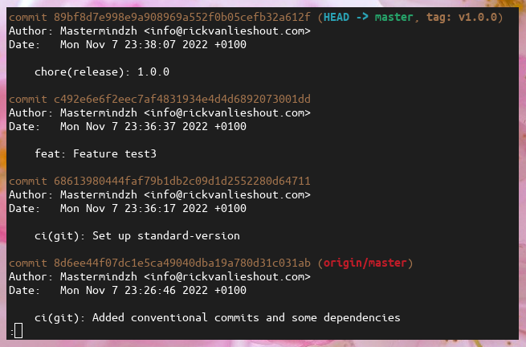

At my place of work, [INFORIT](http://inforit.nl/), we are talking about adopting conventional commits as a company standard.
However... debating commits is a tricky endeavor, everyone seems to have their own opinion about it and pretty much no one is following even the basic git rules (e.g title + body). It is precisely because of all of this that an earlier proposal about standardizing commit messages brought us nothing.

Now though, a solid 2 years later, our company has grown tremendously!
Not just in actual size, but also in knowledge. The developers that were resistant to standardization, hell... even git, have since come around to many of the ideas that were implemented. Especially after seeing their, often new, colleagues thrive with it.

After seeing one of the new hires use conventional commits and their team being fine with it I decided to take the plunge and submit a proposal for it myself.
Though the proposal only covers "conventional commits" and generating changelog entries from it I will be explaining the entire process of adopting conventional commits and standard versions in this blog post.

## Getting started

Before we can do anything we need a git repository.
I'll be using a hosted git repository (on [Github](https://github.com/Mastermindzh/conventional-commits-showcase)) so I will clone it:

```sh
git clone git@github.com:Mastermindzh/conventional-commits-showcase.git
```

But, if you want to follow along without a hosted repository you can also manually create it yourself:

```sh
mkdir conventional-commits-showcase # create a folder with the name "conventional-commits-showcase"
cd conventional-commits-showcase
git init
```

## What exactly are "conventional commits"

"[Conventional commits](https://www.conventionalcommits.org/en/v1.0.0/)" is a specification that allows developers to write commits that are easily parsable by both developers and systems alike. Or in their own words:

> The Conventional Commits specification is a lightweight convention on top of commit messages. It provides an easy set of rules for creating an explicit commit history; which makes it easier to write automated tools on top of. This convention dovetails with SemVer, by describing the features, fixes, and breaking changes made in commit messages.

According to the specifications the commit message should be structured as follows:

```git
<type>[optional scope]: <description>

[optional body]

[optional footer(s)]
```

The specification also allows us to specify a "footer" with breaking changes and ticket references.
A full example, with a breaking change and a fictional ticket number of `95043` would look like this:

```git
feat(api): A test title for a change to the API

I made a few changes to the API. Now I have to write a body.
This is a looooooong body.
Multiple lines :O

BREAKING CHANGE: Well, I have to write something here... so :)
fixes #95043
```

## Let's get the dependencies installed

First, let's make sure our repository contains an npm environment.
If not, run:

```sh
npm init
```

Now that we have a `package.json` file we can start installing some dependencies:

```sh
npm install --save-dev husky @commitlint/cz-commitlint commitizen commitlint standard-version
```

That will give us all the dependencies we need during this blog:

| Dependency                                                                        | function                                                                              |
| --------------------------------------------------------------------------------- | ------------------------------------------------------------------------------------- |
| [Husky](https://github.com/typicode/husky)                                        | Allows us to easily manage and execute git hooks                                      |
| [commitlint](https://github.com/conventional-changelog/commitlint)                | Checks whether our commit messages meet the conventional commits specification        |
| [@commitlint/cz-commitlint](https://github.com/conventional-changelog/commitlint) | adapter for commitlint to use commitizen                                              |
| [commitizen](https://github.com/commitizen/cz-cli)                                | Provides a prompt during commit to fill in necessary information                      |
| [standard-version](https://github.com/conventional-changelog/standard-version)    | Semver based release management and changelog generator based on conventional commits |

## Setting up the commitlint and commitizen configuration

First, let's add a script to the `package.json` that will do our commit for us:

```json
{
  "scripts": {
    "commit": "git-cz",
  }
}
```

Now, when we call `npm run commit` it will actually run `git-cz` which will start our commitizen prompt.
You can try it if you want, it won't actually do anything but throw an error right now.
We can also configure commitizen in the package.json as well, to do so we add `commitizen` to the `package.json`'s config object:

```json
{
  "config": {
    "commitizen": {
      "path": "@commitlint/cz-commitlint"
    }
  }
}
```

If you ran `npm run commit` before and got an error, you can now do it again and face another, but different, error!

Now we'll set up the actual commit linting. Start by creating a file `commitlint.config.js` with the following content:

```js
module.exports = {
  rules: {
    "body-leading-blank": [1, "always"],
    "body-max-line-length": [2, "always", 100],
    "footer-leading-blank": [1, "always"],
    "footer-max-line-length": [2, "always", 100],
    "header-max-length": [2, "always", 100],
    "subject-case": [2, "never", ["start-case", "pascal-case", "upper-case"]],
    "subject-empty": [2, "never"],
    "subject-full-stop": [2, "never", "."],
    "type-case": [2, "always", "lower-case"],
    "type-empty": [2, "never"],
    "type-enum": [
      2,
      "always",
      [
        "first type",
        "second type",
      ],
    ],
  },
  prompt: {
    questions: {
      type: {
        description: "This is the first prompt!",
      },
    },
  },
};

```

As you can see we have configured a whole bunch of things, but there are 2 things that matter for now:

- a single "question" in our prompt.
- a few types (first and second type)

Staging a few files (`git add <file>`) and running `npm run commit` will show us our prompt and a choice between the two types:


Now, our current config isn't very useful, so let's add some more types and a few additional questions (the defaults):

```js
module.exports = {
  rules: {
    "body-leading-blank": [1, "always"],
    "body-max-line-length": [2, "always", 100],
    "footer-leading-blank": [1, "always"],
    "footer-max-line-length": [2, "always", 100],
    "header-max-length": [2, "always", 100],
    "subject-case": [2, "never", ["start-case", "pascal-case", "upper-case"]],
    "subject-empty": [2, "never"],
    "subject-full-stop": [2, "never", "."],
    "type-case": [2, "always", "lower-case"],
    "type-empty": [2, "never"],
    "type-enum": [
      2,
      "always",
      [
        "build",
        "chore",
        "ci",
        "docs",
        "feat",
        "fix",
        "perf",
        "refactor",
        "revert",
        "style",
        "test",
        "content",
        "blog",
      ],
    ],
  },
  prompt: {
    questions: {
      type: {
        description: "Select the type of change that you're committing",
        enum: {
          content: {
            description: "A new piece of content",
            title: "Content",
            emoji: "✨",
          },
          feat: {
            description: "A new feature",
            title: "Features",
            emoji: "✨",
          },
          fix: {
            description: "A bug fix",
            title: "Bug Fixes",
            emoji: "🐛",
          },
          docs: {
            description: "Documentation only changes",
            title: "Documentation",
            emoji: "📚",
          },
          style: {
            description:
              "Changes that do not affect the meaning of the code (white-space, formatting, missing semi-colons, etc)",
            title: "Styles",
            emoji: "💎",
          },
          refactor: {
            description:
              "A code change that neither fixes a bug nor adds a feature",
            title: "Code Refactoring",
            emoji: "📦",
          },
          perf: {
            description: "A code change that improves performance",
            title: "Performance Improvements",
            emoji: "🚀",
          },
          test: {
            description: "Adding missing tests or correcting existing tests",
            title: "Tests",
            emoji: "🚨",
          },
          build: {
            description:
              "Changes that affect the build system or external dependencies (example scopes: gulp, broccoli, npm)",
            title: "Builds",
            emoji: "🛠",
          },
          ci: {
            description:
              "Changes to our CI configuration files and scripts (example scopes: Docker, Kubernetes, npm, git)",
            title: "Continuous Integrations",
            emoji: "⚙️",
          },
          chore: {
            description: "Other changes that don't modify src or test files",
            title: "Chores",
            emoji: "♻️",
          },
          revert: {
            description: "Reverts a previous commit",
            title: "Reverts",
            emoji: "🗑",
          },
        },
      },
      scope: {
        description:
          "What is the scope of this change (e.g. component or file name)",
      },
      subject: {
        description:
          "Write a short, imperative tense description of the change",
      },
      body: {
        description: "Provide a longer description of the change",
      },
      isBreaking: {
        description: "Are there any breaking changes?",
      },
      breakingBody: {
        description:
          "A BREAKING CHANGE commit requires a body. Please enter a longer description of the commit itself",
      },
      breaking: {
        description: "Describe the breaking changes",
      },
      isIssueAffected: {
        description: "Does this change affect any open issues?",
      },
      issuesBody: {
        description:
          "If issues are closed, the commit requires a body. Please enter a longer description of the commit itself",
      },
      issues: {
        description: 'Add issue references (e.g. "fix #123", "re #123".)',
      },
    },
  },
};
```

As you can see we have a fair few questions, each with its own description.
The one that will be new to most people is "content", which is a custom type that I added for this very blog.
Reenacting our example commit from before will look like this:


That's pretty nice already! Creating our example commit is nice and easy now.
Next, let's add a git hook to stop us from messing up.

## Setting up git hooks

Without the git hook, we can simply make a commit that doesn't adhere to conventional commits:

```sh
mkdir test-files && touch test-files/test1
git commit -m "this is not conventional :O"
```

Yikes! That is not what we want!
Let's quickly revert it:

```sh
git reset --soft HEAD~1
```

Now, let's add a Husky git hook to combat future commits that are unconventional:

```sh
npx husky-init && npm install
```

This will automatically create the `.husky/pre-commit` file. Let's edit it and add commitlint:

```sh
#!/usr/bin/env sh
. "$(dirname -- "$0")/_/husky.sh"

npx --no-install commitlint --edit "$1"
```

Let's try our unconventional commit again:

```sh
touch test-files/test2
git add test-files/test2
git commit -m "this is not conventional :O"
```

")

Great, our commits seem to be working.
Let's commit all the things we have now before we move on, crucially I will be using the regular git commit and providing the conventional commit syntax myself:

```sh
git commit -m "ci(git): Added conventional commits and some dependencies"
```

## Releases

Now that we've successfully set up conventional commits we want to use those to release our first version and generate a changelog to boot.
First, let's add some npm scripts again:

```json
{
  "scripts": {
    "release": "standard-version",
    "release:minor": "standard-version --release-as minor",
    "release:patch": "standard-version --release-as patch",
    "release:major": "standard-version --release-as major",
  }
}
```

Now, let's add a configuration file for standard-version so that it will generate changelog entries.
Create a file named `.versionrc.json` with the following content:

```json
{
  "types": [
    {
      "type": "feat",
      "section": "Features"
    },
    {
      "type": "fix",
      "section": "Bug Fixes"
    },
    {
      "type": "content",
      "section": "New content",
      "hidden": true
    },
    {
      "type": "chore",
      "hidden": true
    },
    {
      "type": "docs",
      "hidden": true
    },
    {
      "type": "style",
      "hidden": true
    },
    {
      "type": "refactor",
      "hidden": true
    },
    {
      "type": "perf",
      "hidden": true
    },
    {
      "type": "test",
      "hidden": true
    }
  ],
  "commitUrlFormat": "https://github.com/mastermindzh/conventional-commits-showcase/commits/{{hash}}",
  "compareUrlFormat": "https://github.com/mastermindzh/conventional-commits-showcase/compare/{{previousTag}}...{{currentTag}}"
}
```

The first thing we declare is an array of types, for every type we can define a "section" and whether it is hidden or not.
All hidden types will not show up in the changelog, the others will be grouped by type and will have a header with the text specified in the "section" field.
Let's try it:

```sh
git add .versionrc.json package.json
git commit -m "ci(git): Set up standard-version"

# and let's add a feature
touch test-files/test3
git add test-files/test3
git commit -m "feat: Feature test3"
```

**note:** Where I've been using `git commit -m` you can also use `npm run commit` to get the interactive git prompt.
Now, let's release a major version:

```sh
npm run release:major
```


The output is kind enough to tell us how to push our changes to the remote so let's just do it:

```sh
git push --follow-tags origin master
```

Now let's have a look at our `git log`:



Now, let's also look at our changelog:


That looks great! `standard-version` automatically added a header for our version, sub-headers for our types and even linked our commits to the remote as configured in `.versionrc.json`.

## Let's play a little

Now that we have a successful setup we can try a few commits and releases. Let's start with 2 bugfixes and a new feature:

```sh
# our first bugfix
touch test-files/test4
git add test-files/test4
git commit -m "fix: fixed test 4 by doing fancy stuff"

# our second bugfix
touch test-files/test5
git add test-files/test5
git commit -m "fix: test5 was difficult, but we got it"

# and finally a new feature
touch test-files/test6
git add test-files/test6
git commit -m "feat: Added feature number 6! So nice"
```

Now we'll release this as a minor, because we added a new feature. Execute

```sh
npm run release:minor
```


### breaking changes

All is well, but let's introduce a breaking change:

```sh
touch test-files/test7
git add test-files/test7
npm run commit
```

Output:

```shell
> conventional-commits-showcase@1.1.0 commit
> git-cz

cz-cli@4.2.5, @commitlint/cz-commitlint@17.2.0

? Select the type of change that you're committing: feat
? What is the scope of this change (e.g. component or file name) (press enter
to skip): (max 96 chars)
 (0)
? Write a short, imperative tense description of the change: (max 96 chars)
 (38) feature 7, with a few breaking changes
? Provide a longer description of the change (press enter to skip):
 We broke some stuff, woopsie
? Are there any breaking changes?: Yes
? Describe the breaking changes:
 api endpoint 'test7' now returns json instead of xml
? Does this change affect any open issues?: No
[master e7f7b0e] feat: feature 7, with a few breaking changes
 1 file changed, 0 insertions(+), 0 deletions(-)
 create mode 100644 test-files/test7

```

Which gives us the following changelog:


## Conclusion

Phew! That was quite a long post.
Hopefully, you've managed to set up conventional commits and/or standard-releases to your liking and if not there's always the comment section.
The end-result can be found on [Github](https://github.com/Mastermindzh/conventional-commits-showcase), the [Changelog](https://github.com/Mastermindzh/conventional-commits-showcase/blob/master/CHANGELOG.md) is especially pretty.
