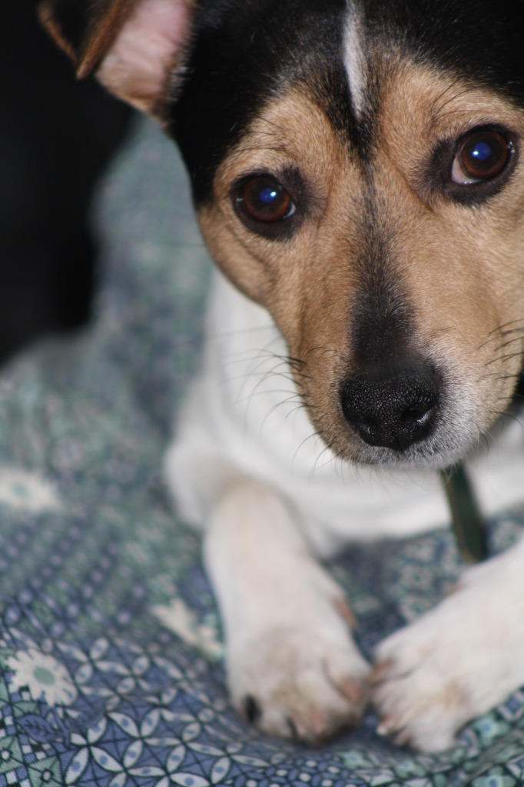

Unfortunately I've had to put my dog Eddy down today.
Eddy was my best friend. Not just my best furry friend, but my best friend period.
He never failed to bring me joy, he was always there when I needed him and he helped me overcome some of life's biggest obstacles just by existing.

Putting him down was very hard for me. Eddy had been in a rough shape for at least a week but I wasn't ready to give up on him.
As a matter of fact, I didn't want to give up until after he was put down. To say I cried like a newborn would be an understatement.
I've felt pain like this in my life before, and I swore I would never let it happen again but Eddy managed to nestle his way too deep in my heart.

I love you Eddy. Always have. Always will. Rest in peace my friend.

> Eddy
>
> 2009-10-18 - 2022-09-30

## Why Eddy had to be put down

<figure class="float-right" style="width: 240px">
	
	<figcaption>Such a cute boy with his ribbon, July 2016</figcaption>
</figure>

Of course this isn't the first time Eddy has had some issues with his health.
During the course of a life many things can happen and some of those will inevitably be bad.
I've included a picture of the time Eddy had to carry a ribbon through his torso to prevent the wound from closing.
Not the prettiest sight but it was worth it because he pulled through.
Apart from that Eddy also had to take medicine twice a day for various other illnesses, and he was very good at hiding his pills too...
Later Eddy lost a lot of his teeth and also a big part of his vision.

The issues with Eddy were much more serious this time though.
Eddy has had stomach ulcers for a long time now and whilst they are somewhat treatable with medication they will almost always develop to become a bigger issue.
In his last few days Eddy began spewing blood, having very dark excrements and generally being a tad cranky. Not traits usually associated with the happy little dog I knew.
Just before Eddy was put down the veterinarian pointed out a hard lump in his stomach, thought to be a cancerous growth.
I felt it and remembered feeling something very similar before. I knew then that we were making the right call.

## mixed feelings

I am not often an emotional wreck, but today I was.
Though, after some thought I realized something that I'd realized before:

> For something to cause me so much pain it had to have brought me joy. Memories are fading in and out, my vision goes blurry. I'm coming short of breath...
> The only thing keeping me sane is knowing I have memories of us, the pictures captured a mere glimpse of it. But my heart captured everything.
>
> \- from the poem `thoughts` by Rick van Lieshout

<figure class="float-left" style="width: 240px">
	
	<figcaption>Very professional doggy. Early 2022</figcaption>
</figure>

And though those feelings are true. I also can't help but shake the sorrow I feel.
I realize, all too well, that I've lost the last thing on this planet that I chose to truly love.
Family ties are great and all, but I chose to spend my life with Eddy. I chose to take care of him and to love him until I couldn't anymore.

A little over 2 years ago I moved out of my parent's house and I unfortunately couldn't take Eddy with me.
Not only because my job doesn't really allow me to take the best emotional care (9-5..) of a dog but also because Eddy is old.
Eddy simply didn't want to move. He knew his surroundings, even though he didn't see very well, and didn't really want to change them up.
Though I went to see him every week (and my parents too...) I still didn't like being away from him for the rest of the week.

I have debated getting a pet of my own. But as I said before I would feel sorry for the animal because I wouldn't be home much.
I also thought of getting a cat, but I just like dogs more.
Now that Eddy has left me completely I will just have to see where life takes me. I sure could use a buddy at times so maybe I will end up adopting a pet anyway.

## Farewell

In the end though, I don't think anything can truly replace Eddy.
I got Eddy an urn so I can have him in my life for the rest of mine.
Sleep well friend.

