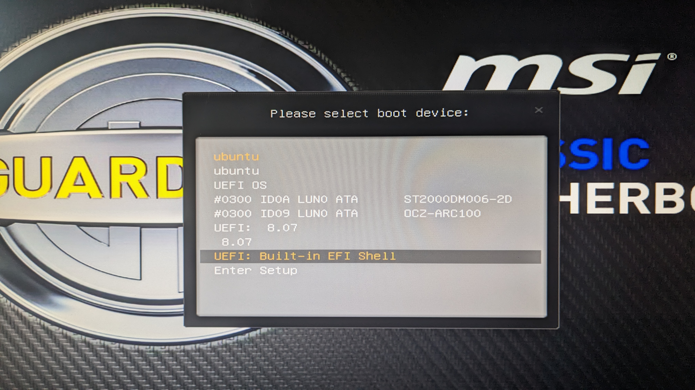
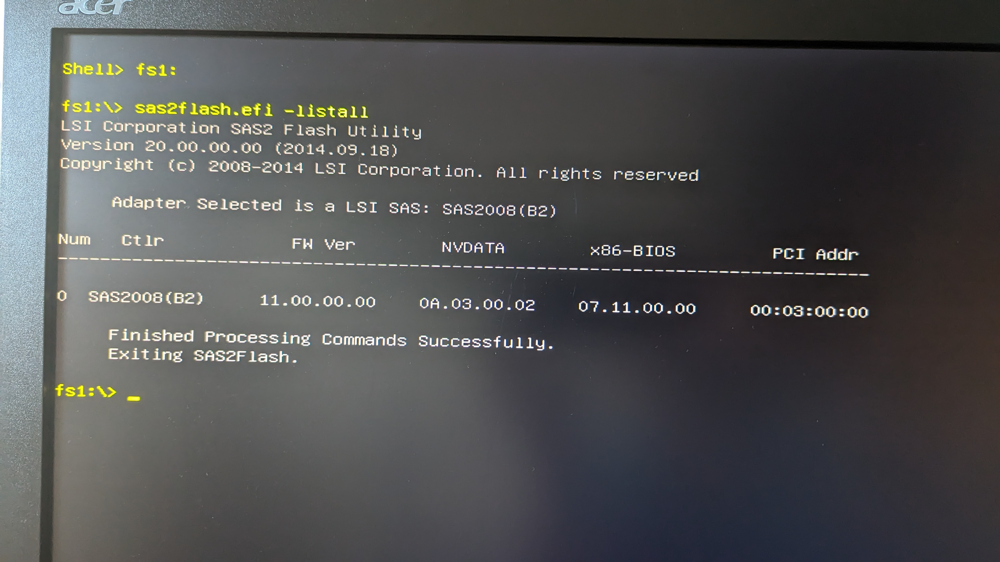
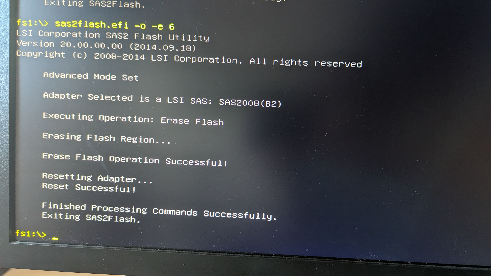
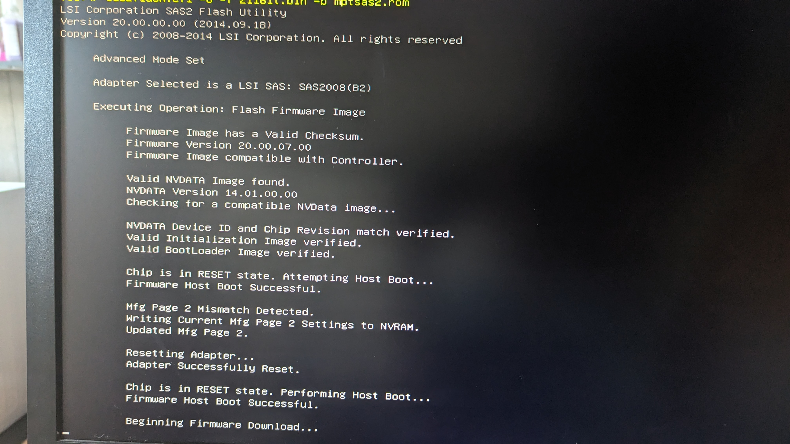

I've been building a new storage-oriented server for a while now and have yet again decided to go with (3 +1 backup) LSI 9211 raid controllers.

The reason I keep going for these specific raid controllers is quite simple. The card can theoretically support (8x500MB) 4GB/s in throughput divided over 8 drives (2x SFF-8087) which is near the maximum for consumer hard drives.

Using 3 of these will allow me to use 24 drives in a single chassis without an expander whilst getting pretty good performance.
The fourth card that I got, and flashed, is simply used as a backup or debug card in case of any errors.

## Downloading the files

Before we can start flashing we will need to download some files.
The table below lists all the files with a brief description of what we'll use them for.

| File                                                            | Description                     |
| --------------------------------------------------------------- | ------------------------------- |
| [EFI flashing utility](https://docs.broadcom.com/docs/12350820) | Flashing utility                |
| [EFI ROM image](https://docs.broadcom.com/docs/12348628)        | Card ROM file                   |
| [SAS2008 Firmware](https://docs.broadcom.com/docs/12350504)     | IR and IT firmware for the 9211 |

## Prepping the flash drive

Make sure that you have a flash drive that is **32GB** or smaller and that it is formatted as **FAT32**.
Next, we'll add the following files to the **root** of the flash drive:

- `Installer_P20_for_UEFI/sas2flash_efi_ebc_rel/sas2flash.efi`
- `UEFI_BSD_P20/uefi_bsd_rel/Signed/x64sas2.efi`
- `9210-8i_Package_P20_IR_IT_FW_BIOS_for_MSDOS_Windows/sasbios_rel/mptsas2.rom`
- `9210-8i_Package_P20_IR_IT_FW_BIOS_for_MSDOS_Windows/Firmware/HBA_9210_8i_IT/2108it.bin`

## Flashing with EFI

Because we are going to flash using EFI we don't really need anything besides the built-in EFI shell from our motherboard. Simply insert the flash drive and go into the BIOS or use the "select boot device" functionality to select the EFI shell:



After the shell has booted successfully you can use the `map` command to see all available devices. In the image below you'll see that my flash drive is listed as `fs1`:


To switch into the drive simply enter the drive name on the command line followed by a semicolon:

```efi
fs1:
```

Next, we'll determine that our adapters are available and we will simultaneously take note of their identifier, we can do so by issuing the following command:

```efi
sas2flash.efi -listall
```



Next, we can empty the current firmware with the following command:

```efi
sas2flash.efi -o -e 6
```



Now we'll simply flash the new (IT-mode) firmware on it with the following command:

```efi
sas2flash.efi -o -f 2108it.bin -b mptsas2.rom
```



Wait patiently until the operations have completed. Note that it might seem like the steps repeat, just wait until it is completely done and exits back to the shell by itself.

## Multiple cards and conclusion

You can rerun the commands for different cards (by adding `-c x` where x is the card number from `listall`) or by simply physically switching the current one out for a different one.

That's all there is too it, if you need any help feel free to hit me up!
