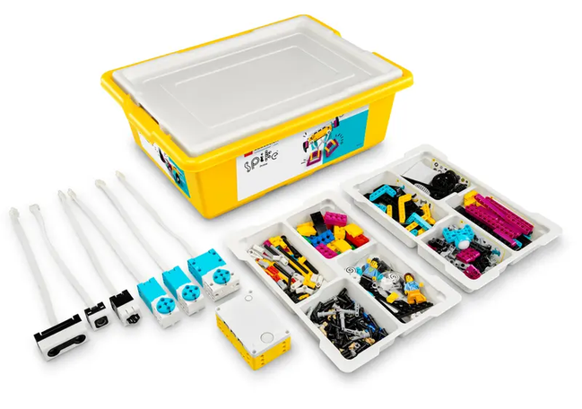
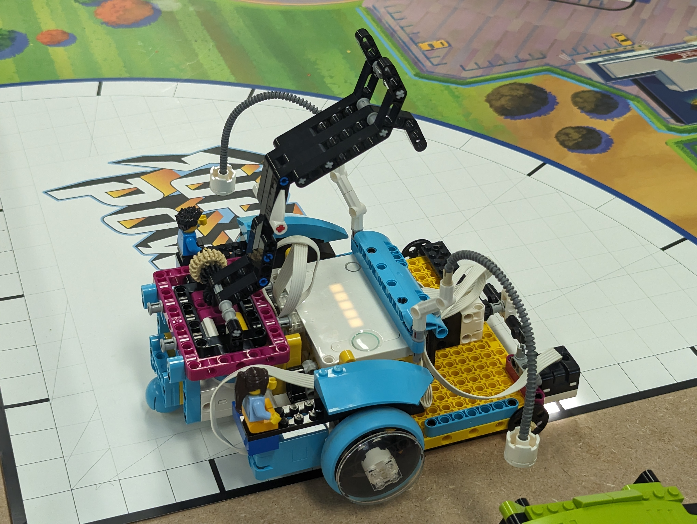
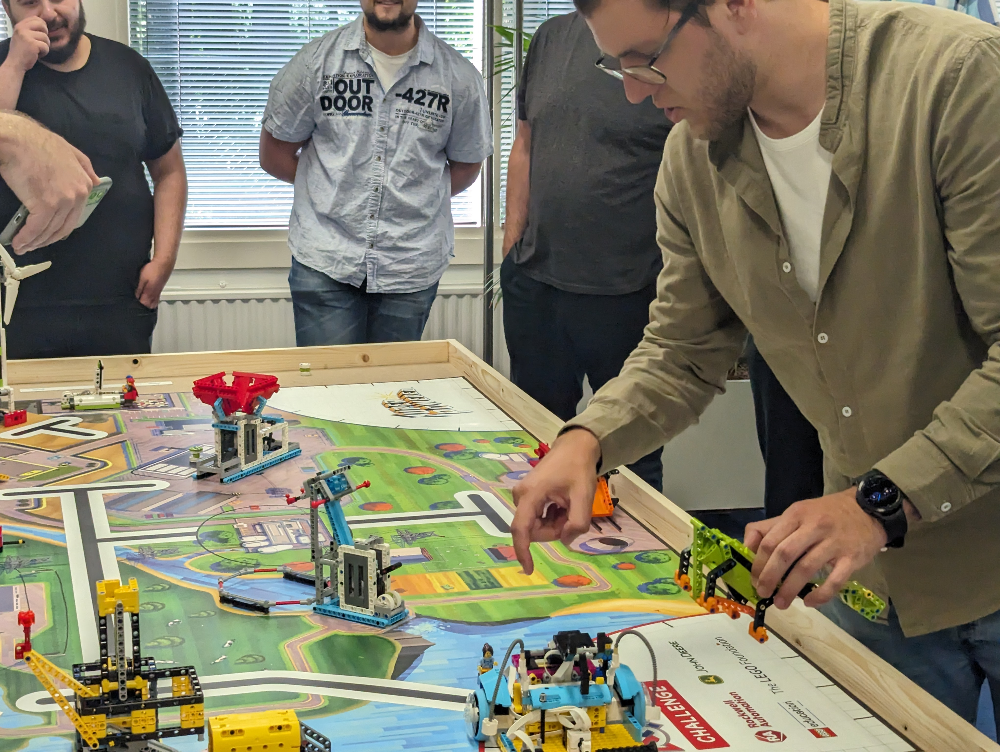
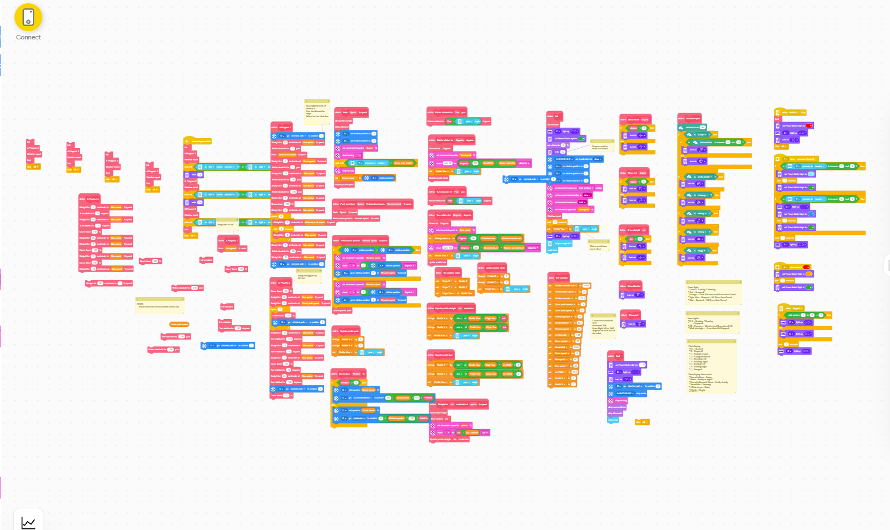

A little before the start of the summer period my colleague Jan-Kees came up to me and proposed the idea of an internal LegoLeague. After a little bit of back-and-forth about what LegoLeague exactly was I agreed it would be a great idea to bring some colleagues together and have a little fun during work hours.
Pretty much right away excitement got the better of us and we started drafting a plan... when? where? how? prizes? teams!?? A lot.
But First...

## What is LegoLeague?

LegoLeague is an event where teams come together to build, program and test a [Lego Spike robot](https://www.lego.com/en-nl/product/lego-education-spike-prime-set-45678) to perform autonomous tasks. The tasks range from collecting "power cores", pushing or pulling levers, to dropping Lego blocks in a hopper to get some bonus points.

All of this is accompanied by a theme, in our case energy production, which adds a layer of fun to solving these challenges.
The video below shows a teaser of 2022-2023's "SuperPowered" event, the very thing we based our LegoLeague on:

<iframe
  width="560"
  height="315"
  src="https://www.youtube.com/embed/okR1AMFNV3Q?si=cq4KqyVVK6sAsCpY"
  title="YouTube video player"
  frameborder="0"
  allow="accelerometer; autoplay; clipboard-write; encrypted-media; gyroscope; picture-in-picture; web-share"
  allowfullscreen>
</iframe>

For each task a team completes successfully they will score points.
Teams get 2 minutes and 30 seconds (2:30) to score as many points as they can.
The video below outlines some of the challenges the teams have available to them with a little explanation of how they function and even some info on the scores. This video is especially useful for teams that don't want to peruse the entire rule book but still wanted to figure out an optimal strategy.

<iframe
  width="560"
  height="315"
  src="https://www.youtube.com/embed/ILTjo0LHZQA?si=YqJvSYX3JNclPPeJ"
  title="YouTube video player"
  frameborder="0"
  allow="accelerometer; autoplay; clipboard-write; encrypted-media; gyroscope; picture-in-picture; web-share"
  allowfullscreen>
</iframe>

To build the robot each team gets a [Lego Spike Prime set](https://www.lego.com/nl-nl/product/lego-education-spike-prime-set-45678) and nothing more!
In the original event, teams had access to a little more Lego in various kits but for our little event at [INFORIT](https://inforit.nl), we were only able to source the basic kits in time.
Having said that, we wouldn't have been able to get our hands on any of the kits at all if it wasn't for the ["PReT" organization in Weesp](https://www.pretweesp.nl/). Thanks guys!

As for the programming... Teams are free to use either "[scratch](https://scratch.mit.edu/)" or "Python" to program their robots.
Scratch being much easier for those who don't spend all day behind their computer working on software development whilst Python allows for more flexibility in what can be achieved.
Spoiler alert: all teams chose scratch, it's much more accessible for non-developers!

## The competition at INFORIT

So yeah, we now know what a LegoLeague is and we have the approval to host the competition at [INFORIT](https://inforit.nl), now what?
Well, Jan-Kees got to work building the arena and setting it up and I set out to gather team members. Given that it was the summer break I had to hustle to get teams together but eventually we managed to create some beautiful teams.

Fortunately, [INFORIT](https://inforit.nl) values employee happiness, autonomy and continuous improvement. As such I was able to offer the 2 Friday afternoons free of day-to-day work, to work on the robot whilst providing catering, music, and the like to the teams whilst they are participating!

In the end, we were successful in creating 4 teams of at least 3 people who were all mixed with developers and non-developers to keep the balance fair. Meanwhile, Jan-Kees also finished building the arena which you can see in the header of this blog or the pictures in the picture section.

## Pictures

Of course, we've taken loads of pictures during the event but those are mostly for internal use.
Below I've included some pictures of the event that are all cleared for social media distribution with a little description of what's happening in each picture to, hopefully, convey some of the vibes of the event itself.

## Winners, losers, etc

In the end, this is still a competition. People competed hard to come out on top and 1 team did so successfully.
Congratulations guys!

")

## Nah, we are all winners in the end

Having 4 teams gave us the unique opportunity to reward them all with something nice. The 3 teams that got podium places all got their medals and their rewards and the team in fourth place got their consolation prize.

Luckily though, we're all winners, even the Jury members and the organizers.
This event has brought us all closer together and improved the connection between our colleagues.
I, personally, had a blast and would love to do similar things in the future.

That's it again, thanks for reading and see you next time!
