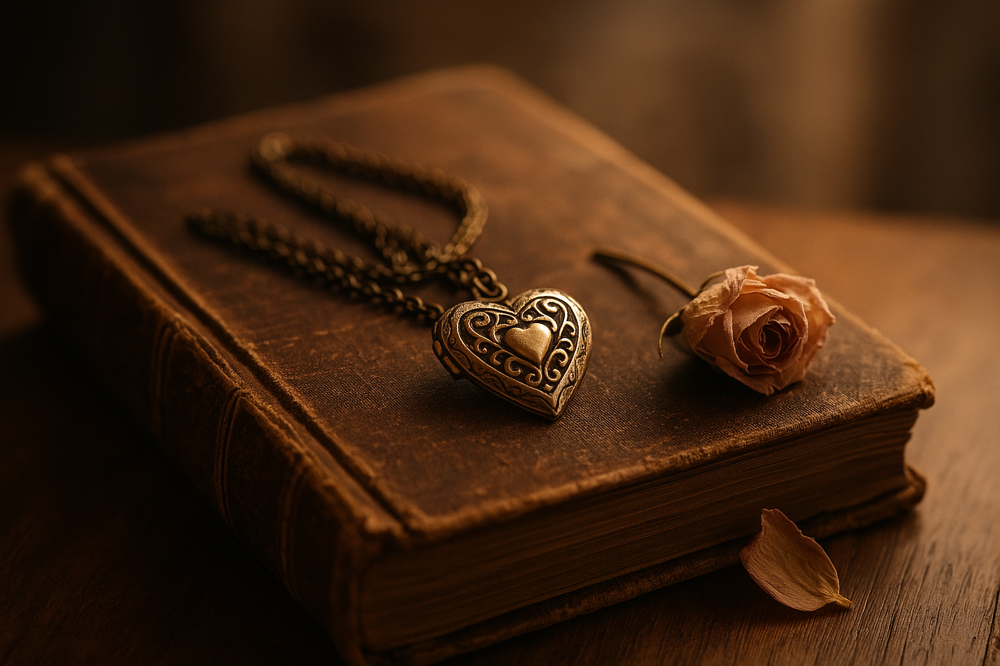

⚠️ <strong>Content Warning</strong> 
This blog contains themes of death, grief, mental health, and emotional trauma. 
It is raw, honest, and may be deeply triggering for some. 
Please read with care and stop if it becomes too heavy. You're not alone.

## A Hidden Life of Pain, Sorrow, Misery and Rampant Emotions

Some kinds of missing are temporary. A friend you haven’t seen in a while. A conversation left unfinished. A plan postponed.

But then there's another kind.

The kind that settles into your bones. The kind that haunts you during the quiet hours. The kind that never finds a conclusion.

That kind is not absence. It's ***gone***. Irrevocable, final, cruel. A door slammed shut that you still find yourself knocking on, long after you’ve forgotten why you started.

It never opens. And still, you try the handle every now and then.

## In the background of every moment

Losing a loved one doesn’t stay in one room of your house though, it isn't one door that is locked. It leaks under doors and through cracks. You find it in the most unexpected places.

You're sipping coffee with someone, and they mention a trip they took. Suddenly, you're remembering the trip *you* never took. The one you'd planned. The one that cancer took from you.

They talk about a shared playlist. You remember the song you danced to in the rain, soaking wet but laughing anyway. The same song you now skip every time it comes on because it hurts too much

Someone laughs about chipped mugs. You think of the one she cracked and called "vintage," and how it's still at the back of your cabinet. Untouched. Sacred.

It’s like walking through a museum where only *you* know what’s behind the glass.

> They talk, they laugh, the world goes on, 
> Yet I sit with shadows, from dusk to dawn.  
> A smile here hides a silent scream, 
> A haunted heart, a broken dream.

<figure class="float-right" style="width: 240px">
 
</figure>

These are what I call *mind pops*. Short for Involuntary Autobiographical Memory Chains. I wrote a journal-like book once, and later a smaller one. I wanted to share them. I tried. But I was never brave enough to.

Mind pops come uninvited. And they come *hard*.
Here are some examples from my book:

- The eyeliner she never quite got even.
- The way she tucked me in, thinking I was asleep.
- The fake wedding we planned just to see what colors we'd choose.
- Your love for Twilight. And the moment we realized, quietly, you'd never get to read the next book—if there ever was one.
- The mole you've had removed and I pretended not to notice. I did miss it so.
- The mixture of guilt, remorse and happiness in your eyes as conscious life ebbed away.

They’re not just memories. They’re grenades. Quiet ones. You never know when they'll detonate. Nor whether they will ruin your entire day.

> A flicker in time, unbidden and wild, 
> A whisper of laughter, a memory smiled. 
> Then tears arrive with no request, 
> The heart’s old wounds laid bare, unblessed.

## Unfair doesn’t even begin to cover it

We grow up believing that the world has some kind of order to it. That bad things happen, sure—but not *this* bad. Not *this* unfair.
You lose someone who made life feel infinite. You watch them disappear into the haze of hospital lights and soft-spoken specialists.

Cancer doesn’t care if you’re young. Or kind. 
Or if you had a hundred plans left.
It just takes. 
And keeps taking.

And you're left with jewelry in a drawer. Her necklace still smells like her. 
Sometimes I take it out. I hold it. Smell it. Let it transport me. I don’t even know if I should still be doing that. But it’s a thread. One of the last ones.

> This necklace, cold, rests in my hand, 
> The last soft echo of a silent land. 
> I breathe her in, though she's not near, 
> A ghost in scent, in touch, in tear.

## The masks we wear

For a long time, no one knew. Most don't, still.

People see the version of you they expect: Smiling. Joking. Coping. Existing. 
But behind the eyes, you’re unraveling. Constantly. Because grief doesn’t pause. 
Not ***really***.

Sharing this is hard. Not because I don’t want to, but because it makes you so vulnerable. Because as you're writing or speaking, memories pop up uninvited. They derail your words. They choke your sentences. They just pop in... bastards...

And even when you manage to share, others often don’t understand. They compare. They say things like “I lost someone too,” but it’s different. This kind of grief? This kind of loss? It’s heavier. It cuts deeper. And hearing it treated like it’s the same as all the rest—*that* makes you angry.

Here’s something I once wrote, when I thought no one would ever read it:

> I'm surrounded by many figures, but still alone... 
>No one sees me, nor the pain behind my mask. 
>They see the smiling, happy guy I show them. 
>You can't blame them though, how can I let them see the darkness in my heart?  
> It would scare them, for it has been torn apart.

I didn’t want to scare people. Or burden them. So I said nothing. 
For years.

## Strange rituals of survival

<figure class="float-right" style="width: 240px">
 
</figure>

Grief makes you do strange things too.. 
One of my telltale behaviors is that I start eating, lots... but there are weirder ones. 
More unexpected ones...

I’ve spoken out loud to pictures. Imagined new conversations. Tried to conjure her in dreams. I’ve spent hours crafting memories that never happened, just to feel like I got one more day.
I name items, characters, and other things in games after her.
If I eat alone, at a restaurant, I order what she would’ve. (who do I kid, I sometimes do it with company too...)

And I wrote a song. It’s unfinished though—like she was.

**🎵 (Refrain)** 
*A strand of blonde hair, as delicate as sun,* 
*A mystery found, in silence it's spun.* 
*But memory, like a fleeting breeze,* 
*Fades away as a haze, in the time we seize.*  

**🎶(Verse)** 
*Days pass like rustling leaves,* 
*Stories fade, like quiet thieves.* 
*How swiftly memory slips away,* 
*Like an old melody, lost in the fray.* 

*A mysterious gate, in the labyrinth of the mind,* 
*Locked and hidden, what secrets behind?*

As I'm writing this blog however, I have a sudden urge to add sound to the lyrics, it'll still be unfinished, but a little farther along.
I used both a piano and a viola to give it a more interesting sound than just the piano.

  <audio controls>
    <source src="./media/a-strand-of-blonde-hair-as-delicate-as-sun.mp3" type="audio/mpeg">
  Your browser does not support the audio element.
  </audio>

   
  <a href="./media/a-strand-of-blonde-hair-as-delicate-as-sun.pdf" target="_blank">score</a> |
  <a href="./media/a-strand-of-blonde-hair-as-delicate-as-sun.mid" target="_blank">midi</a> |
  <a href="./media/a-strand-of-blonde-hair-as-delicate-as-sun.flac" target="_blank">flac</a>

## The final moments and the words that stayed

There are memories too hard to sit with for long. But they come back, as clear as yesterday.

The quiet nights filled with endless conversation. Plans made, even though we both knew we'd never see them through. Fantasies of places we'd never travel, children we’d never have, shows we’d never finish.

She once told me something that still echoes today:

> "You have to grieve me, for a while... and then you move on.  
> You find someone else to love. Someone who makes you feel something again.   You deserve that."

I shook my head. *"I can’t. I **won’t**. Not because I don’t want to feel again. But because abstinence, to me, feels like remembering you as you are. Eternal."*  
We both cried after that. For different reasons, I think.

### My words weren't true though

But life went on. And I did try. I did have relations after her.
And every single one felt... off. Wrong. Like stepping into a life that wasn’t meant to fit me anymore.

They weren’t bad people. In fact, I think some of them really tried to care. But the weight of comparison was impossible to escape. The shadow she left was too wide.

Sometimes I’m mad at myself for trying. Other times, I’m mad at myself for failing to let them in.
And always,...always,.. I feel like I betrayed her just a little.

I know grief isn’t rational. It doesn’t follow clean lines. 
And maybe that’s what hurts most of all—knowing I tried, and still came back to the same place.  
Alone, but full of someone who isn’t here.

One day... *maybe*.

## Why I’m finally speaking

It’s taken me over a decade to find the strength to say any of this.
And maybe the only reason I can now… is her.

But also—my mother. 
She’s terminally ill. And while it’s “natural” for a parent to go before their child, it’s still excruciating.  
We don't know how long she's got left, but I know we'll make the best of it. For both of us.

I do find myself ashamed to admit that it hasn’t hit me quite the same way. But it’s not lesser. It’s just different. A different wound on the same, torn, body. 
And this time, I’m watching it happen while knowing exactly what’s coming. And I'm scared.  
For **everyone**.

I think often of my brothers. For them, this may be their first real loss. Their first brush with the permanence of death. 
And it breaks me in new ways to imagine them feeling what I felt, without ever seeing it coming. I'll try to be there for them, as you do.

But it's at least part of why I’m writing now. That’s why I’m finally saying all this. 
Because pain grows in the dark.

In a moment of foolish bravery, I once planned to publish my journaled thoughts. That book. That attempt to show what this kind of loss looks like. 
I didn’t. I **couldn’t**.

But maybe I can share this blog.

## On those who want(ed) to leave

I need to say something with a very serious tone now, and I do hope you read it gently and thoroughly:

I’ve met people over the years who’ve carried this same grief. And some of them have found themselves teetering.

On the edge.

Wondering if there’s peace on the other side of absence. 
Let me say this clearly: I have never thought of taking that road for myself. If anything, I would *ask* for eternal life. Even with the grief. 
But if you are someone who has stood on that edge:

**Don’t. Please.**

The pain is real. The grief is heavy. But life—*even broken life*—has light in it still. And sometimes, all you need is one person willing to sit with you in the dark.

Let me be that person for a moment. Just long enough to remind you: the door might be closed, but the room isn’t empty.

If you are on the edge. Seek help. ([dutch](https://www.113.nl) | [english](https://www.113.nl/english))
Whatever you do, don't pass on the pain.

## What help looks like

Over the past two years, I’ve slowly—*achingly*—learned to live with it.
And honestly, I'm happier now than I've ever been since.

I’ve had friends. Real ones. Some with the training to guide me through the murk. Others who simply sat there while I unraveled, trying their best.

They didn’t try to fix me. They didn’t rush me. They just showed up.
They had always been there, I just didn't allow them to be there for me before.

I’ve learned that grief isn’t a wall to climb or a puzzle to solve. It’s a landscape.

You don’t conquer it. 
You *walk it*. One aching step at a time. 
And if you're lucky... you don’t walk it alone.

### To those who held me together

There’s a quiet kind of heroism in being the one who stays.
Not the one who fixes. Not the one with the right words.
Just… the one who stays.

To those of you who sat with me in silence,
who didn’t flinch at the weight of my words,
who let me cry without needing to understand why.
thank you.

To those who asked how I was and meant it.
Who asked again when I lied the first time.
Who sent messages I never responded to, but always read.
Thank you.

To those who reminded me that it was okay to laugh.
To love again.
To mess up.
To heal slow.
Thank you.

And to the ones who didn’t even know they helped—
you did.

You all held the thread when I couldn’t anymore.
And maybe that’s the reason I’m still happy...
Still holding her memory, but not drowning in it.

## Before I finally sign off

This entire blog was something I never thought I could write.
And what comes next,this next part, is something I swore I *never* would share.

But here we are.

What follows is the foreword and some pages from the book I wrote years ago. A raw collection of thoughts, pain, patterns, and memory. I’ve always wanted to share it, and I’ve always been too scared. Too protective. Too convinced no one would understand.

My grief has changed, not disappeared, never that. But shifted.
And time has a way of loosening things you once held too tight.
Of showing you that even pain deserves to breathe.

So this is me, still afraid—but doing it anyway. 
This is me, defiant in the face of silence. 
This is me, opening the door just a little wider.

What comes next is the truth as I once wrote it, in a different voice, at a different time (2021-2022)—but still very much me.

### A Peek into the Pain and Misery

**The foreword to a book I once wrote titled "A Peek into the Pain and Misery"**

We, humans, perceive the vast majority of other humans we encounter as bystanders, observers and otherwise side characters in our own lives. Yet, each and every one of them has a life of comparable complexity to our own. Realizing that for the first time is an emotion called "sonder".

This book will give you a small glimpse into my life. By the end, you might find that I'm more complex than you've thought till now. That there's another side to the happy, carefree guy I show the world for the majority of my time.

Truth is, that life hasn't always been easy. In fact, I'd say that after the turning point my life has never felt easy anymore. In fact,  for at least 10 years now I've been living with prodigious amounts of a single emotion: bereavement.

And though I've tried not to let the bereavement take over my life, or in fact make it known to others. it's always been there. I've effectively come to think of it as a zit. Constantly there, constantly annoying and once it's gone away it's only a matter of time before it shows up again somewhere else on your body.

Ten years is truly a long time. In it, I've tried countless things to forget my sorrow. I've written songs and poetry. I've indulged in life's greatest things. I've thrown myself into the pursuit of knowledge and I've even tried to seclude myself, thinking that I'd become a burden to the world.
However, In trying to cope with it I've also made many mistakes. I've experienced more loss, extirpated meaningful connections and, to my deepest regret, hurt others.
And even now, 10 full years later I'm still burdened by the same emotions, though now compounded by the feelings and mistakes of the past 10 years.

Furthermore, During these 10 years, on nearly every day I've been haunted by something I've come to know as Involuntary Autobiographical Memory Chains, or as I now like to call them: mind pops.
Mind pops are sudden memory flashes, seemingly triggered at random, about things I've experienced prior. These mind pops never seem to go away and can alter my mood for the rest of the day with the emotions they invoke.

I've actually been able to capture the entire story of the past 10 years in a book, of sorts, titled "a hidden life of pain, sorrow, misery and rampant emotions". And though I've always wanted to share the entire story, I've never been strong enough to do so. Not 10 years ago, not now, and maybe not ever.

But... The urge to share... something... is still there.
So on the 1st of January 2021, I set out on a challenge. I wanted to, at least, share a part of the story. Not one from a distant past though, one of constant remembrance. One of pain and pleasure. One I've lived for every day of the entire year. One I'll live for every day for many years to come.

Every page henceforth will contain one "mind pop" that I've had on the date listed. So turn over this page and join me on my struggle from January 1st through December 31st of 2021.

<figure style="width: 240px">
 
</figure>

<figure style="width: 240px;">
 
</figure>

<figure style="width: 240px;">
 
</figure>

## A postscript

If you’ve read this far—thank you.
That alone means more than you know.

*- Rick, mastermindzh, lycan, xxxroosjexxx, and other alias' you might know me from.*
