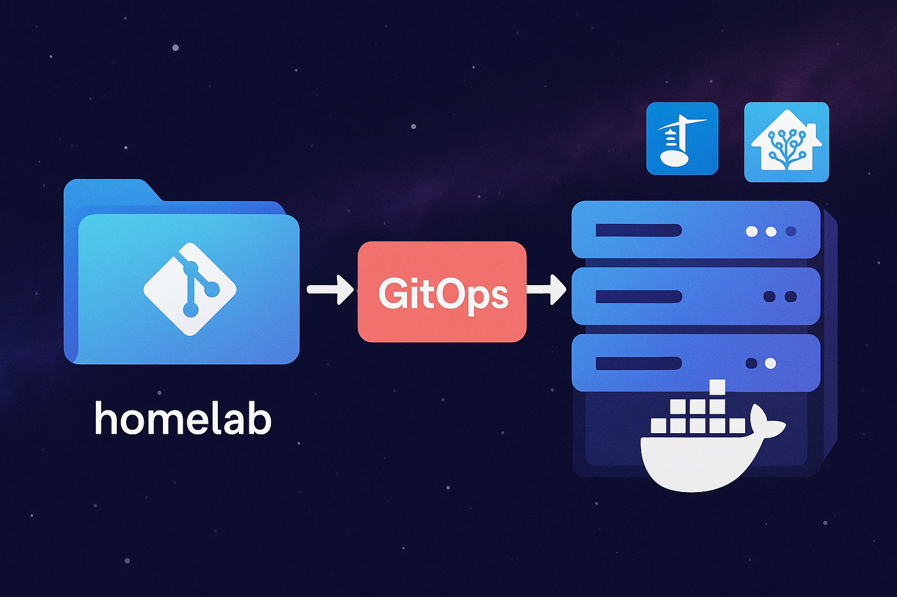

After writing my last blog post about using Infrastructure as Code for uptime monitoring with UptimeKuma, I felt inspired to dive deeper into my broader homelab story.

## From Complexity to Clarity

When I started building my homelab, it was all about experimenting and having fun. Kubernetes, Ansible, HA clusters spread across multiple nodes... I dove into everything headfirst. The concept of Infrastructure as Code (IaC), something I fell deeply in love with thanks to Kubernetes, quickly became the backbone of my ideal setup.

Yet, as much as I enjoyed the complexity and elegance Kubernetes brought to my experiments, I soon realized something pretty obvious: when it comes to crucial services like Jellyfin for movies or Home Assistant for managing my smart home, the last thing I needed was an over-engineered, highly available Kubernetes cluster requiring constant babysitting.

## The Before Times

It reminded me of simpler times, the "before times", before Docker and Kubernetes even existed. Back then, my homelab consisted of multiple Ubuntu servers, each handling different parts of my setup, along with a single, reliable main server named "Erebus," using Greyhole for redundancy. Even when Docker came along (and later Kubernetes), I adopted them immediately for non-critical, experimental projects, but crucial services always remained comfortably on one stable server. After all, Kubernetes-level scalability was never really necessary for my home media or automation and I could still use all the benefits of Docker.

## Hades, the Storage Behemoth

Today, this philosophy still holds true. My critical services run smoothly on a single Unraid server, my trusted main storage server named "Hades." On Hades, it’s a pleasantly chaotic mix of Unraid's Docker plugin, community apps, and various Docker Compose files. Each container has decentralized configuration variables, with updates effortlessly handled by Unraid's auto-update plugin.

Here's the ironic twist: despite having Kubernetes nodes running non-critical, playful stuff, all my serious storage still ends up on Hades. Honestly, nothing else compares. Hades dwarfs every other node in my network storage-wise, think around 200TB of free space at any given time. Even Kubernetes relies heavily on Hades for its back-end storage.

## Simplifying with Portainer GitOps

Still, this fragmented setup felt manual and messy. I missed the simplicity and clarity of Infrastructure as Code. Thankfully, Portainer's Ops feature came to my rescue, allowing me to blend the massive storage and ease of use from Unraid with structured IaC management. To fully leverage this, I registered for 3 free nodes of Portainer Business Edition, unlocking their powerful GitOps feature.

Portainer's GitOps polls my private Git repository for updates to Docker Compose files at regular intervals, automatically deploying any changes. It seamlessly integrates with Docker Hub, pulling the latest container images and ensuring my stacks remain updated without manual intervention. This automation keeps my services fresh and secure with minimal effort.

The UptimeKuma example from my last blog is one such stack I recently migrated to this new, cleaner workflow.

## The Best of Both Worlds

Now, I have the best of both worlds—a robust and neatly structured setup embracing Infrastructure as Code without sacrificing ease of use or storage headaches. In other words, I could keep the things I liked best about my Kubernetes (the predictability and IaC parts) and got rid of its worst (multiple nodes, manual updates). &#x20;

On to the next adventure!
