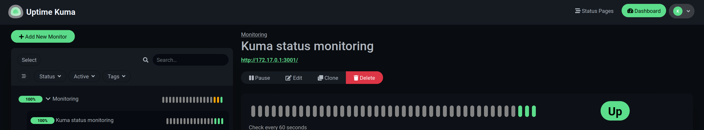

If there’s one thing I’ve always embraced, it’s the philosophy of working smarter, not harder. Infrastructure as Code (IaC) has been one of the cornerstones of my career. a perfect blend of laziness and the pursuit of predictability. From my earliest days experimenting with Docker back in 2014 to leading a platform team at my current company, IaC has proven invaluable for simplifying complexity, ensuring reproducibility, and enabling automation.

Below you'll find my journey and why I think every engineer should embrace it, eventually walking you through one of the latest automations I set up at home: Automatically creating uptime monitors in UptimeKuma based on Docker labels.

## The Early Days: Discovering Docker

Back in 2014, I stumbled upon Docker, and it was a game-changer. At the time, I was frustrated by the manual and error-prone process of setting up environments for my code (especially on other people's machines....). Docker offered a way to reliably recreate these environments with simple, declarative configuration files. Suddenly, I could spin up a development environment in minutes and be confident it would work exactly the same on another machine.

In 2017, I taught several university classes on Docker, emphasizing the importance of reproducibility. My students learned how to containerize applications and ensure their work could be shared and run anywhere, regardless of underlying infrastructure. Reproducibility wasn’t just a technical advantage; it became a mindset I encouraged in every project.

And yes.. for those that know me well, I did go overboard in some of the details and even ended up explaining the entire Copy-On-Write (COW) nature of the Docker filesystem in those classes... But ah well, people learned a lot :P.

## Home Servers: The Personal Lab

My passion for IaC extended to my home servers. By 2017, nearly everything I ran at home was Docker-based. I created dozens of bash scripts and system services to orchestrate my personal infrastructure. Whether it was media servers, backup systems, or development environments, everything was automated and version-controlled. Even my own computers mostly became IaC based as I figured out that part of the Linux community was saving their setups (and install instructions, usually) in so called "dotfiles". To this day you can still find my setup (and its changes when I switch machine) in my [Dotfiles on Github](https://github.com/Mastermindzh/dotfiles/).

All in all, my home setup became a sandbox for testing new ideas and tools, many of which eventually found their way into my professional work as well.

## Scaling IaC in the Workplace

At my current company, I introduced Docker about eight years ago. It was a gradual process, but within a year, we had our first Kubernetes cluster running. This transition wasn’t just about adopting new tools; it was about embedding the principles of IaC into the organization’s culture.

Over time, I spearheaded the creation of a dedicated platform team. With an architect/Product Owner and four DevOps engineers, this team took IaC to the next level. They implemented robust CI/CD pipelines, infrastructure monitoring, and scalable deployment patterns. Some of these practices mirrored what I had done at home, while others were tailored to the unique needs of the business. The result was a resilient and predictable infrastructure that supports rapid development and deployment.

## Setting Up Uptime Monitoring with UptimeKuma

One of the most satisfying aspects of IaC is the ability to automate even the smallest tasks. Take uptime monitoring, for example. At home and at work, ensuring that services are available is critical. Recently, I’ve been using my old UptimeKuma instance, a self-hosted monitoring tool that’s as powerful as it is user-friendly, a lot more after introducing it to some friends (who started homelabbing) and at work.

Setting up UptimeKuma is straightforward, you can simply use our old friend Docker:

```docker run -d --name uptime-kuma -v ./data/uptimekuma:/app/data -p 3001:3001 louislam/uptime-kuma```

And access the Dashboard by navigating to <http://localhost:3001> to configure your monitors.
But that isn't automatic enough for me, I like to put my things in compose files for home usage.

## Automating uptime monitors with AutoKuma

[AutoKuma](https://github.com/BigBoot/AutoKuma) allows us to set labels on our Docker containers that will then automatically generate monitors in UptimeKuma.

One of my containers (UptimeKuma actually) has the following labels attached:

```yml
labels:
  kuma.monitoring.group.name: "Monitoring"
  kuma.uptime_kuma.http.parent_name: "monitoring"
  kuma.uptime_kuma.http.name: "Kuma status monitoring"
  kuma.uptime_kuma.http.url: "http://${HOST_IP}:3001"
```

This actually does 2 things:

- creates a group with the *key/id* `monitoring` and the name `Monitoring`
- Adds a monitor with the *key/id* `uptime_kuma` to UptimeKuma with the type `http`, name `Kuma status monitoring`, and url `http://${HOST_IP}:3001`

Adding these labels, whilst AutoKuma is running and configured to pick up labels starting with `kuma` is enough for monitors to show up (after restarting the containers).
All in all, my `docker-compose.yml` file for both UptimeKuma and AutoKuma now looks like this:

```yml
services:
  autokuma:
    image: ghcr.io/bigboot/autokuma:master
    restart: unless-stopped
    environment:
      AUTOKUMA__KUMA__URL: http://${HOST_IP}:3001
      AUTOKUMA__KUMA__USERNAME: ${KUMA_USERNAME}
      AUTOKUMA__KUMA__PASSWORD: ${KUMA_PASSWORD}
      AUTOKUMA__TAG_NAME: AutoKuma
      AUTOKUMA__TAG_COLOR: "#42C0FB"
      AUTOKUMA__DEFAULT_SETTINGS: |-
        docker.docker_container: {{container_name}}
        http.max_redirects: 10
        *.max_retries: 3
      AUTOKUMA__DOCKER__LABEL_PREFIX: kuma
      AUTOKUMA__MIGRATE: true
    volumes:
      - ${APP_DATA}/autokuma:/data
      - ${DOCKER_SOCKET}:/var/run/docker.sock
    depends_on:
      - kuma

  kuma:
    image: louislam/uptime-kuma:1
    volumes:
      - ${APP_DATA}/uptimekuma:/app/data
      - ${DOCKER_SOCKET}:/var/run/docker.sock
    ports:
      - 3001:3001
    restart: unless-stopped
    labels:
      kuma.monitoring.group.name: "Monitoring"
      kuma.uptime_kuma.http.parent_name: "monitoring"
      kuma.uptime_kuma.http.name: "Kuma status monitoring"
      kuma.uptime_kuma.http.url: "http://${HOST_IP}:3001"
```

## Problems... the compose file doesn't work :O

If you'd try to run the compose file in the previous chapter, even after replacing all the variables, things likely still won't work.
This is because AutoKuma relies on the credentials for UptimeKuma which we setup during the initial launch of UptimeKuma.
Unfortunately, that account is the only account we can currently set up in UptimeKuma since it doesn't have user management.
And yes, that means we **have** to use these same credentials to get AutoKuma to work, which also prohibits us from enabling MFA.

Anyway, after setting up the kuma account, simply adjust both the `KUMA_USERNAME` and `KUMA_PASSWORD` variables and restart the containers.
After doing so we should see the monitor appear in UptimeKuma:



## The Future of IaC

Infrastructure as Code isn’t just a technical approach; it’s a philosophy that prioritizes automation, reproducibility, and simplicity. Whether you’re managing a home lab or a global platform, IaC provides the tools and practices to build resilient systems with minimal effort.

For me, IaC has been a journey of continuous learning and experimentation. From Docker to Kubernetes, from bash scripts to dedicated platform teams, the principles remain the same: automate everything, document everything, and embrace the predictability that code brings to infrastructure.

If you haven’t already, give UptimeKuma and AutoKuma a try. Their combination is an excellent example of how IaC can simplify even the most mundane tasks, leaving you more time to focus on what really matters... or just to be a little lazier.
