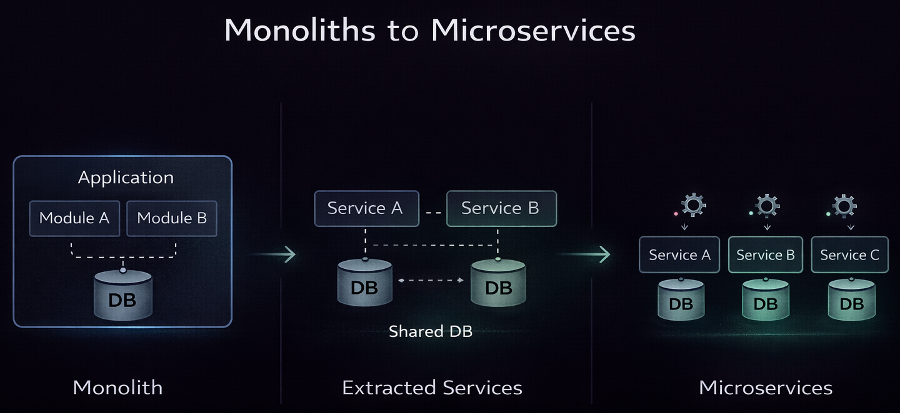

## From simplicity to scale, and everything in between

In the previous article we explored what software architecture really is: a set of decisions that shape how a system evolves over time. This time we will look at how those decisions take shape in the structure of your system.

Most discussions around architecture quickly turn into debates. Monolith versus microservices. Centralised versus distributed. Right versus wrong. In practice, it is rarely that simple.

Systems evolve. Teams evolve. Context evolves. The shape of your architecture should evolve with it.

## Start simple: the modular monolith

Almost every system benefits from starting as a **modular monolith**. One deployable, one runtime, but with clear internal boundaries.

That distinction matters. A monolith without structure becomes a problem. A modular monolith, with well-defined modules and ownership, gives you clarity without introducing unnecessary complexity.

You move fast and deploy easily, without the operational overhead of distributed systems. More importantly, you learn. You learn where your real boundaries are, which parts of your system change frequently, and how your team collaborates.

That learning is what enables the next step.

Of course, this only works if you take the modular part seriously. If everything can call everything, you have not built a modular monolith. You have just built a smaller version of your future problems. Clear boundaries, explicit interfaces, and discipline are essential.

This also applies to data. If every module shares the same database tables and freely reads from each other, your boundaries are not real. Separating database context per module, even within the same runtime, forces ownership and prevents accidental coupling.

It might feel like overhead early on, but it pays off later. When parts of your system need to move independently, those boundaries become the foundation for doing so.

## A good problem: when your system starts to feel the pressure

At some point, a well-structured monolith will start to show strain. Not because it is poorly built, but because the system is growing.

You might see long-running tasks slowing down request handling, ingestion workloads increasing, or scheduled jobs competing with user traffic. Teams may start stepping on each other’s toes.

This is not a failure. It is a good problem to have.

It means your product is working.

The mistake many teams make at this point is jumping straight to microservices.
There is a more natural step in between, which we'll explore below.

## Extracting services: evolving beyond the monolith

Instead of breaking everything apart, you start by extracting the parts that need it.

Think of sending emails in batches, running scheduled jobs, handling heavy ingestion pipelines, or offloading compute-heavy processes. These are often isolated concerns with clear inputs and outputs, making them good candidates to run independently.

Because your modular monolith already has boundaries, these parts can be moved out with relatively little friction. If a module owns its logic and data, extraction becomes straightforward. If it does not, hidden coupling quickly becomes visible.

At this stage, your system becomes partially distributed, but intentionally so. The monolith still handles the core domain, whilst specific responsibilities are moved into separate services that can scale and evolve independently.

This is not an accident. It is a system responding to real pressure.

It is also where anti-patterns can appear if you are not careful. Services without clear ownership, fake autonomy, or excessive communication are signs that boundaries are not yet well defined.

## Microservices: autonomy comes at a cost

Microservices promise independence. Independent deployments, scaling, and ownership.

When done well, they deliver exactly that. But they are not free.

You introduce network boundaries, eventual consistency, and operational complexity that simply does not exist in a monolith. Observability becomes harder, debugging becomes harder, and understanding the system as a whole becomes harder.

Coordination does not disappear. It just changes form.

Where you once had compile-time dependencies, you now have runtime dependencies. Where you once had local calls, you now deal with contracts, versioning, and failure scenarios.

This is why starting with microservices is rarely a good idea. Unless you are building for massive scale from day one, you are taking on complexity you do not yet need.

It is far better to grow into microservices. Let the system show you where separation makes sense and move boundaries only when the benefit clearly outweighs the cost.

This shift introduces a different kind of complexity that teams often underestimate. Once everything is distributed, understanding what is happening becomes harder by default. Requests cross service boundaries, data flows asynchronously, and failures are no longer local.

That is why, even now, when new engineers join, one of the first things we teach them is how to debug a distributed system. Once you cross that boundary, everything changes.

## It is not a switch, it is a spectrum

One of the biggest misconceptions is that systems are either monoliths or microservices.

In reality, most systems live somewhere in between. You might have a modular monolith at the core, a few extracted services for heavy workloads, and some fully independent services where autonomy is critical.

That is not a failure of design. It is a reflection of reality.

Different problems require different solutions. Forcing everything into a single model often creates more problems than it solves.

## Choosing the right shape

So how do you decide?

You look at your context. How mature your team is, how well you understand the domain, where your system is under pressure, and what kind of change you expect.

Then you make a trade-off.

Start simple. Build a modular monolith with clear boundaries. Pay attention to where pressure builds and act just before it turns into pain.

## My reflection on how we dealt with it at Inforit / Frontliners

Looking back, we did not follow this path cleanly.

We jumped into microservices early. There were ambitious plans that made it feel like the right thing to do, and with a small but strong team we managed to deliver multiple products in that setup.

But it came with a cost. The complexity was high, the learning curve was steep, and many of the problems we were solving were not yet problems we actually had.

We only really started addressing this properly at scale with the newer version of our system. That is where the focus shifted from building services to building something sustainable.

## Wrapping up

Architecture is not about choosing the right structure upfront. It is about choosing the right structure for now, whilst preparing for what comes next.

Start simple. Let the system grow. Evolve your architecture just ahead of your problems, not far ahead of your understanding.

The moment where your modular monolith starts to struggle is not something to fear. It is a signal that you are building something meaningful.

And if you have prepared your boundaries well, that next step becomes a lot more manageable.

In the next article, we will look at what happens once your system becomes truly distributed, and how communication patterns shape everything that follows. We will dive into **data events versus domain events**, and why that distinction matters more than it first appears.
