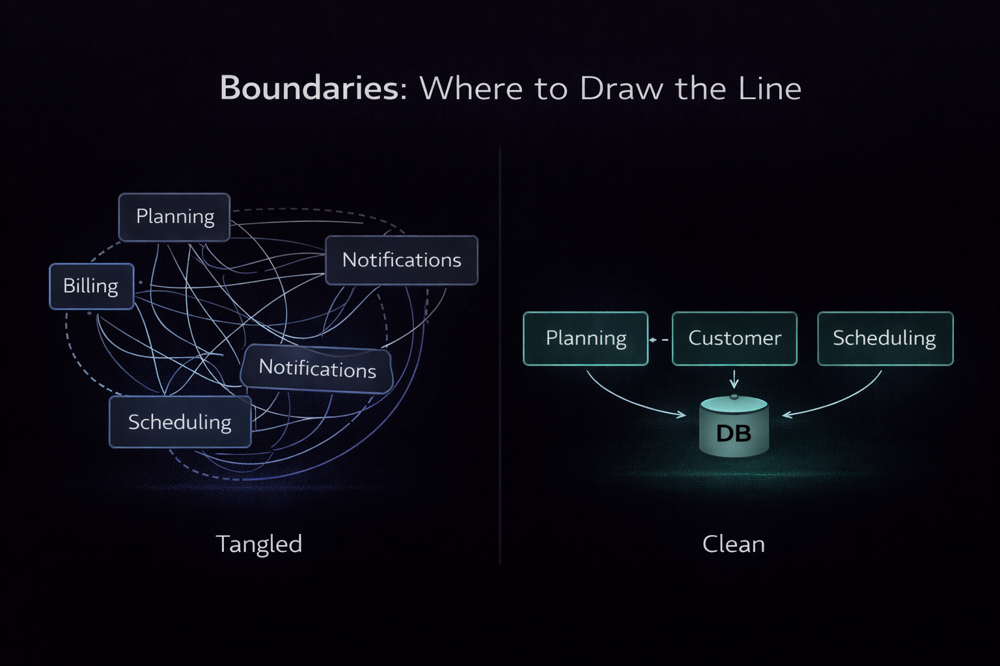

In the previous articles we explored how systems evolve structurally, and how they communicate. Both of those topics depend on one underlying concept: **boundaries**.  
Where you draw them determines how your system behaves.

Get them right, and everything feels simpler. Get them wrong, and no amount of tooling, patterns, or infrastructure will save you.

## Most problems are boundary problems

A lot of architectural discussions focus on technology choices. Frameworks, messaging systems, deployment strategies. After all, that is also really fun to talk about.
In practice, however, most real problems have very little to do with those things.

They come from boundaries that were drawn in the wrong place.

Services that depend on each other for basic logic. Data that is shared across parts of the system that were meant to be independent. Teams stepping on each other’s toes because ownership is unclear.
Or the most frustrating one: systems that were split up, but nothing actually became simpler.

That is almost always a boundary problem.

## What is a boundary, really?

A boundary is not a folder, a repository, or a service.

It is a decision about ownership.

- Who owns this logic?
- Who owns this data?
- Who decides how it evolves?

You can draw boundaries inside a modular monolith, or across multiple services. The shape does not matter as much as the clarity. A good boundary reduces the need for communication. A bad boundary creates it.

## Start from the core

In many systems, there is a central process that everything revolves around.
At my current employer's world, that is planning.

Customers are planning how to move loads from one place to another. They are optimising routes, combining shipments, and trying to make that process as efficient as possible.

**That** is the core of the business.

When boundaries are not defined carefully, everything starts to leak into that core. Suddenly, planning is responsible for things it should not care about. Notifications, integrations, data transformations, and edge cases all start piling up.
At that point, it becomes harder to change, harder to understand, and harder to scale.

The goal of boundaries is not to split everything evenly. It is to protect the core.

## Data ownership is the real boundary

One of the clearest ways to define a boundary is through data ownership.

If two parts of your system share the same data freely, they are not truly separate. They are coupled, whether you acknowledge it or not.

That is why a strong default is simple:

> Each boundary owns its data.

That does not mean you can never be pragmatic. There are situations where sharing data is the least bad option. But those should be conscious decisions, not the default.

If you start from shared data and try to separate later, you will feel the pain immediately.
If you start with ownership, you at least have the option to relax it when needed.

## Teams define boundaries, whether you like it or not

Architecture does not exist in isolation.

The way your teams are structured will shape your system. This is often referred to as Conway’s Law, but you do not need the name to see it in practice... If multiple teams need to work on the same part of the system every day, your boundaries are probably wrong.

If one team owns a domain end-to-end, including its data and behaviour, things tend to move faster and cleaner.

This also ties into maturity.

A highly experienced team can handle more complex boundaries, more decoupling, and more asynchronous communication. A less experienced team will struggle if the system requires too much coordination or implicit knowledge.

Good architecture meets teams where they are, not where you wish they were.

## Where things go wrong

There are a few patterns that show up again and again.
One of the most common is “***everything is a service***”.
Every feature becomes its own service, often without clear ownership or responsibility. The system looks nicely split on paper, but in reality everything depends on everything else.
You end up with a distributed system that behaves like a monolith, but with all the downsides of distribution.

Another common issue is ***shared databases across supposed boundaries***.  
Two services, two repositories, maybe even two teams, all reading and writing to the same tables. At that point, the separation is an illusion.
Changes ripple through the system in unpredictable ways, and coordination becomes unavoidable.

Then there are ***boundaries defined by technology instead of domain***. 
A service for the API, a service for the database, a service for background jobs. These are technical slices, not business boundaries. They tend to create more communication, not less.

And finally, the most subtle one: ***boundaries that looked right at the time, but were never revisited***. 
Systems evolve. Teams evolve. What made sense a year ago might not make sense today. If boundaries stay fixed whilst everything else changes, they slowly become a source of friction.

## Drawing better boundaries

There is no formula that guarantees the right answer, but there are good starting points:

- Look at your core processes. Where does the business logic naturally group together?
- Look at your data. Who should own it, and who should not?
- Look at your teams. Where can you give ownership without constant coordination?
- And most importantly, look at where your system hurts today. Boundaries should reduce that pain, not introduce new kinds of it.

## It is an ongoing process

Just like everything else in architecture, boundaries are not a one-time decision.
They shift over time.

As your system grows, you will discover that some boundaries were too broad, others too narrow. Some will need to be split, others merged. That is normal.

The goal is not to get it perfect from the start. The goal is to make decisions that can evolve.

## Wrapping up

I repeat: Most architectural problems are boundary problems.
When boundaries are clear, communication becomes intentional. Systems become easier to understand, easier to change, and easier to scale.

When boundaries are unclear, everything becomes harder. Not because the technology is wrong, but because the structure does not match the reality of the system.

Start with ownership. Protect your core. Be pragmatic when needed, but deliberate in your decisions.

And most importantly, revisit your boundaries over time. Because the system you are building today is not the system you will have a year from now.

In the next article, we will look at what it really means to run a distributed system, and why things that used to be simple suddenly become much harder.
