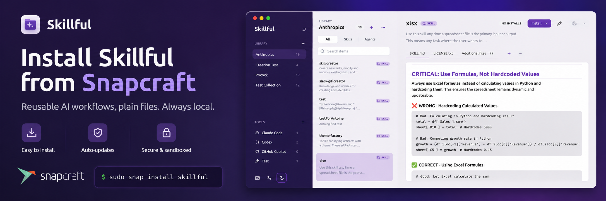

A few weeks ago I started building a tool called Skillful.

It didn’t start as a product idea.

It started as friction.

## The Problem: AI Workflows are everywhere and nowhere

If you use AI tools regularly, you probably recognise this:

- prompts live in ChatGPT
- some live in Cursor
- some are buried in Obsidian
- some are in random `.md` files
- screenshots live somewhere else entirely and you copy-paste them into your prompt when required
- helper scripts are in a repo you forgot about

Everything works… until you try to reuse it.
Or worse, until you try to **share it across tools**.

That’s where things fall apart.

You end up copying the same workflow five times:

- once for ChatGPT
- once for Cursor
- once for a markdown note
- once for a repo
- once for “just in case”

And now you have five slightly different versions.

None of them are “the source of truth”.

## The Idea: Files as the Source Of Truth

Skillful is built around a very simple idea:

> Your workflows should just be files.

Not a database.
Not a SaaS backend.
Not tied to a single tool.

Just files on disk.

Each “skill” or “agent” is a folder.

Inside that folder you can have:

- prompts
- markdown notes
- screenshots
- helper scripts
- metadata

And that folder becomes the **single source of truth**.

From there, Skillful handles:

- installing it into tools (Cursor, VS Code, etc.)
- linking everything together
- keeping things in sync

No copies.
No drift.

## Filesystem-First By Design

This is probably the most important architectural choice.

Skillful is filesystem-first.

That means:

- your data stays on your machine
- no accounts
- no sync service
- no telemetry
- no lock-in

If Skillful disappears tomorrow, your files are still there.

You can open them with any editor.
Version them with Git.
Move them anywhere.

Skillful is just a layer on top.

Not a dependency.

## How I Actually Use It

The easiest way to understand Skillful is through usage.

### 1. Create A Skill

I start with a folder:

```txt
skills/
  api-review/
    SKILL.md
    notes.md
    examples/
    scripts/
```

Inside `SKILL.md` lives the actual prompt I use.
`notes.md` contains context, edge cases, things I learned.

Sometimes I add:

- sample inputs
- expected outputs
- helper scripts

That folder becomes a reusable unit.

### 2. Link It To Tools

Skillful lets me “install” that skill into different tools.

Instead of copying the prompt, it links it.

So:

- Codex sees it
- Claude sees it
- other tools see it
- updates propagate automatically

Change the file once, everything updates.

That’s the key difference.

### 3. Reuse Everywhere

Now the same workflow can be used:

- inside editors
- inside AI tools
- inside scripts
- inside repos

Without duplication.

Without drift.

## One Source, Every Tool

One thing I didn’t expect initially is how valuable this becomes over time.

Once you have a growing library of skills:

- you stop rewriting prompts
- you start refining them
- you start composing them
- you start trusting them

And because everything is file-based, it’s trivial to:

- version control them
- share them
- review them
- evolve them

It starts feeling less like prompts and more like actual software.

## Why Not Just Use Notion / ChatGPT / X?

Because those tools are not designed for reuse across environments.

They are designed for:

- interaction
- storage
- sometimes collaboration

But not for:

- cross-tool installation
- filesystem ownership
- reproducibility
- composability

Skillful is not trying to replace those tools.

It sits next to them.

It makes the workflows portable.

## Break-Proof Installs

One small but important feature is how installs behave.

Instead of copying files into tools, Skillful links them.

That means:

- no duplication
- no stale versions
- no mystery bugs from “which version is this?”

And if something breaks?

You can repair it in a click.

Or just delete and re-link.

Because the source is always your folder.

## Your Library, Your Disk

This is probably the most important part philosophically.

Skillful does not own your data.

You do.

There is:

- no cloud dependency
- no vendor lock-in
- no hidden sync
- no background services

Everything stays local.

Which also means:

- it works offline
- it’s fast
- it’s predictable

## Final Thoughts

Skillful isn’t trying to be a massive platform.

It’s trying to solve one very specific problem:

> How do I make AI workflows reusable without losing control over them?

For me, the answer ended up being surprisingly simple:

Files.

Plain files.
On disk.
As the source of truth.

Everything else builds on top of that.
If that resonates with how you work, you can check it out here: [Skillful](https://skillful.md)

And if nothing else, maybe it gives you a different way to think about managing your own workflows.


