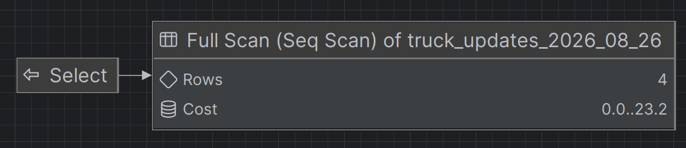
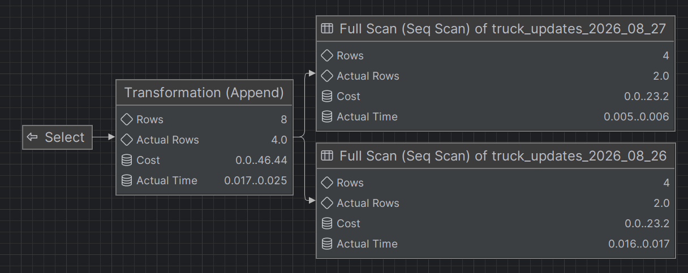

Some tables grow slowly enough that you can mostly forget about them, others just keep accumulating data forever and are *never* a real issue. Then there are tables that are used to store "hot" data that is relevant for a certain period and loses much of its relevance after a "little while".

For this blog we'll look at the use-case of trucks sending their active location along with some additional info back to the Transport Management System (TMS) so it can do various things (like updating a map, calculating arrival time, and influencing planning by being early/late at its destination).

Imagine servicing thousands of trucks, with every truck reporting its position and status every 15 seconds.
Even at only 1,000 trucks that is:

```text
1,000 trucks × 4 updates/minute
= 4,000 rows/minute
= 5,760,000 rows/day
= ~40 million rows/week
```

That gets big rather quickly. Even downscaling to location updates once a minute won't really help us:

```text
1,000 trucks × 1 update/minute
= 1,000 rows/minute
= 1,440,000 rows/day
= ~10 million rows/week
```

At this point you'll generally start wondering if you want to store this data in a table at all, and often people will reach for alternative solutions, or find some way to change the amounts. Now I'm not saying you *need* all the data, truck status updates per 10 minutes would be perfectly fine in all but the rarest use-cases... but you probably don't get to design a system for 1000 trucks right off the get-go, it'll start with a handful of trucks when you build the system and then slowly increase from there. And whilst you're delivering value elsewhere this poor table is getting stressed more and more and queries start naturally slowing down.

In the remainder of the blog we'll talk about [Postgres' time-based partitioning](https://www.postgresql.org/docs/current/ddl-partitioning.html) capabilities. For the use-case described it's a very cheap and more importantly quick fix that'll hold up long term, but partitioning itself has lots of useful use-cases and when applied well, is extremely powerful.

In our blog use-case, we want to keep roughly a week of data readily available for users to interact with.
After that, the data is mostly interesting for the rare situation where somebody needs to dig through history or an order drags out unusually long.

**note**: make sure to pick a relevant timeframe that fits your use-case as that will make management much simpler.
In the chapter [Archiving without moving millions of rows](#archiving-without-moving-millions-of-rows) we'll see how we can archive/move big chunks of data without too much of an issue regardless so even if your first bet is off you'll be fine in the long run.

## Creating the partitioned table

Let's start by creating a simple table to store the events. Instead of creating one enormous table, we create a **partitioned** table instead:

```sql
CREATE TABLE truck_updates (
    id BIGINT GENERATED ALWAYS AS IDENTITY,
    truck_id UUID NOT NULL,
    payload JSONB NOT NULL,
    received_at TIMESTAMPTZ NOT NULL DEFAULT now()
) PARTITION BY RANGE (received_at);
```

Creating a table with a partition means the table itself does not store any rows. Its partitions do.
If we were to try and insert some data that doesn't belong to a partition we would get the following error:

```/bin/sh
[23514] ERROR: no partition of relation "truck_updates" found for row
Detail: Partition key of the failing row contains (received_at) = (2026-08-25 08:15:00+00).
```

To fix that we'll create three example partitions:

```sql
CREATE TABLE truck_updates_2026_08_25
PARTITION OF truck_updates
FOR VALUES FROM ('2026-08-25 00:00:00+00')
         TO   ('2026-08-26 00:00:00+00');

CREATE TABLE truck_updates_2026_08_26
PARTITION OF truck_updates
FOR VALUES FROM ('2026-08-26 00:00:00+00')
         TO   ('2026-08-27 00:00:00+00');

CREATE TABLE truck_updates_2026_08_27
PARTITION OF truck_updates
FOR VALUES FROM ('2026-08-27 00:00:00+00')
         TO   ('2026-08-28 00:00:00+00');
```

Depending on the use-case you'd have `received_at` specified manually (for trucks, messages can take a bit to reach the TMS if they travel over slow connections), or use a server generated timestamp (`now()`) where that doesn't apply. For this example we'll explicitly provide it however so we can insert some data into all three partitions and check what postgres is actually doing:

```sql
INSERT INTO truck_updates (
    truck_id,
    payload,
    received_at
)
VALUES
(
    '22a24942-5505-45ee-9374-a4f266542437',
    '{"speed": 78, "latitude": 51.68, "longitude": 5.29}',
    '2026-08-25 08:15:00+00'
),
(
    '22a24942-5505-45ee-9374-a4f266542437',
    '{"speed": 82, "latitude": 51.69, "longitude": 5.30}',
    '2026-08-25 14:30:00+00'
),
(
    '22a24942-5505-45ee-9374-a4f266542437',
    '{"speed": 75, "latitude": 51.71, "longitude": 5.31}',
    '2026-08-26 09:00:00+00'
),
(
    'f735f44f-91dc-4295-99c7-526adb43c42e',
    '{"speed": 91, "latitude": 51.73, "longitude": 5.34}',
    '2026-08-26 16:45:00+00'
),
(
    '22a24942-5505-45ee-9374-a4f266542437',
    '{"speed": 83, "latitude": 51.74, "longitude": 5.35}',
    '2026-08-27 07:30:00+00'
),
(
    'f735f44f-91dc-4295-99c7-526adb43c42e',
    '{"speed": 68, "latitude": 51.76, "longitude": 5.37}',
    '2026-08-27 11:15:00+00'
);
```

All six inserts went to `truck_updates`, but PostgreSQL routed them to the correct physical table based on `received_at`.
We can prove that by querying the partitions directly:

```sql
SELECT *
FROM truck_updates_2026_08_25;
```

```text
+--+------------------------------------+---------------------------------------------------+---------------------------------+
|id|truck_id                            |payload                                            |received_at                      |
+--+------------------------------------+---------------------------------------------------+---------------------------------+
|2 |22a24942-5505-45ee-9374-a4f266542437|{"speed": 78, "latitude": 51.68, "longitude": 5.29}|2026-08-25 08:15:00.000000 +00:00|
|3 |22a24942-5505-45ee-9374-a4f266542437|{"speed": 82, "latitude": 51.69, "longitude": 5.30}|2026-08-25 14:30:00.000000 +00:00|
+--+------------------------------------+---------------------------------------------------+---------------------------------+
```

And:

```sql
SELECT *
FROM truck_updates_2026_08_26;
```

```text
+--+------------------------------------+---------------------------------------------------+---------------------------------+
|id|truck_id                            |payload                                            |received_at                      |
+--+------------------------------------+---------------------------------------------------+---------------------------------+
|4 |22a24942-5505-45ee-9374-a4f266542437|{"speed": 75, "latitude": 51.71, "longitude": 5.31}|2026-08-26 09:00:00.000000 +00:00|
|5 |f735f44f-91dc-4295-99c7-526adb43c42e|{"speed": 91, "latitude": 51.73, "longitude": 5.34}|2026-08-26 16:45:00.000000 +00:00|
+--+------------------------------------+---------------------------------------------------+---------------------------------+

```

Our application normally doesn't need to know those tables exist though. It just queries `truck_updates`:

```sql
SELECT
    *
FROM truck_updates
ORDER BY received_at;
```

That returns all six rows across all three partitions.
PostgreSQL also exposes a handy system column called `tableoid`. We can use that to see which physical table every result came from, though we'll have to specifically ask for it, just using `*` doesn't return it:

```sql
SELECT
    tableoid::regclass AS partition,
    *
FROM truck_updates
ORDER BY received_at;
```

Which gives us something along the lines of:

```text
+------------------------+--+------------------------------------+---------------------------------------------------+---------------------------------+
|partition               |id|truck_id                            |payload                                            |received_at                      |
+------------------------+--+------------------------------------+---------------------------------------------------+---------------------------------+
|truck_updates_2026_08_25|2 |22a24942-5505-45ee-9374-a4f266542437|{"speed": 78, "latitude": 51.68, "longitude": 5.29}|2026-08-25 08:15:00.000000 +00:00|
|truck_updates_2026_08_25|3 |22a24942-5505-45ee-9374-a4f266542437|{"speed": 82, "latitude": 51.69, "longitude": 5.30}|2026-08-25 14:30:00.000000 +00:00|
|truck_updates_2026_08_26|4 |22a24942-5505-45ee-9374-a4f266542437|{"speed": 75, "latitude": 51.71, "longitude": 5.31}|2026-08-26 09:00:00.000000 +00:00|
|truck_updates_2026_08_26|5 |f735f44f-91dc-4295-99c7-526adb43c42e|{"speed": 91, "latitude": 51.73, "longitude": 5.34}|2026-08-26 16:45:00.000000 +00:00|
|truck_updates_2026_08_27|6 |22a24942-5505-45ee-9374-a4f266542437|{"speed": 83, "latitude": 51.74, "longitude": 5.35}|2026-08-27 07:30:00.000000 +00:00|
|truck_updates_2026_08_27|7 |f735f44f-91dc-4295-99c7-526adb43c42e|{"speed": 68, "latitude": 51.76, "longitude": 5.37}|2026-08-27 11:15:00.000000 +00:00|
+------------------------+--+------------------------------------+---------------------------------------------------+---------------------------------+
```

So querying the parent really is querying the underlying partitions.
More importantly, PostgreSQL doesn't necessarily have to query *all* of them.
Let's ask for data from August 26th:

```sql
SELECT id, tableoid::regclass AS partition, received_at
FROM truck_updates
WHERE received_at >= '2026-08-26 00:00:00+00'
  AND received_at <  '2026-08-27 00:00:00+00';
```

PostgreSQL knows from the partition definitions that neither the 25th nor the 27th can possibly contain matching rows.
We can see that using `EXPLAIN`:

```sql
EXPLAIN (ANALYZE, VERBOSE)
SELECT id, tableoid::regclass AS partition, received_at
FROM truck_updates
WHERE received_at >= '2026-08-26 00:00:00+00'
  AND received_at <  '2026-08-27 00:00:00+00';
```

The exact numbers will differ between PostgreSQL versions and machines, but the interesting part of the result looks like this:

```text
+----------------------------------------------------------------------------------------------------------------------------------------------------------------------------------+
|QUERY PLAN                                                                                                                                                                        |
+----------------------------------------------------------------------------------------------------------------------------------------------------------------------------------+
|Seq Scan on public.truck_updates_2026_08_26 truck_updates  (cost=0.00..23.20 rows=4 width=20) (actual time=0.017..0.018 rows=2.00 loops=1)                                        |
|  Output: truck_updates.id, (truck_updates.tableoid)::regclass, truck_updates.received_at                                                                                         |
|  Filter: ((truck_updates.received_at >= '2026-08-26 00:00:00+00'::timestamp with time zone) AND (truck_updates.received_at < '2026-08-27 00:00:00+00'::timestamp with time zone))|
|  Buffers: shared hit=1                                                                                                                                                           |
|Planning Time: 0.166 ms                                                                                                                                                           |
|Execution Time: 0.036 ms                                                                                                                                                          |
+----------------------------------------------------------------------------------------------------------------------------------------------------------------------------------+

```

Or more visually (through Datagrip):


Notice what isn't there:

```text
truck_updates_2026_08_25
truck_updates_2026_08_27
```

They've been pruned from the query plan entirely.
If our query spans two days instead:

```sql
EXPLAIN (ANALYZE, VERBOSE)
SELECT *
FROM truck_updates
WHERE received_at >= '2026-08-26 00:00:00+00'
  AND received_at <  '2026-08-28 00:00:00+00';
```

we'll see PostgreSQL combine the relevant partitions:

```text
+--------------------------------------------------------------------------------------------------------------------------------------------------------------------------------------------+
|QUERY PLAN                                                                                                                                                                                  |
+--------------------------------------------------------------------------------------------------------------------------------------------------------------------------------------------+
|Append  (cost=0.00..46.44 rows=8 width=64) (actual time=0.009..0.014 rows=4.00 loops=1)                                                                                                     |
|  Buffers: shared hit=2                                                                                                                                                                     |
|  ->  Seq Scan on public.truck_updates_2026_08_26 truck_updates_1  (cost=0.00..23.20 rows=4 width=64) (actual time=0.009..0.010 rows=2.00 loops=1)                                          |
|        Output: truck_updates_1.id, truck_updates_1.truck_id, truck_updates_1.payload, truck_updates_1.received_at                                                                          |
|        Filter: ((truck_updates_1.received_at >= '2026-08-26 00:00:00+00'::timestamp with time zone) AND (truck_updates_1.received_at < '2026-08-28 00:00:00+00'::timestamp with time zone))|
|        Buffers: shared hit=1                                                                                                                                                               |
|  ->  Seq Scan on public.truck_updates_2026_08_27 truck_updates_2  (cost=0.00..23.20 rows=4 width=64) (actual time=0.003..0.003 rows=2.00 loops=1)                                          |
|        Output: truck_updates_2.id, truck_updates_2.truck_id, truck_updates_2.payload, truck_updates_2.received_at                                                                          |
|        Filter: ((truck_updates_2.received_at >= '2026-08-26 00:00:00+00'::timestamp with time zone) AND (truck_updates_2.received_at < '2026-08-28 00:00:00+00'::timestamp with time zone))|
|        Buffers: shared hit=1                                                                                                                                                               |
|Planning Time: 0.081 ms                                                                                                                                                                     |
|Execution Time: 0.026 ms                                                                                                                                                                    |
+--------------------------------------------------------------------------------------------------------------------------------------------------------------------------------------------+

```


Again, `truck_updates_2026_08_25` isn't touched.

This is called **partition pruning**. Because our query constrains the same `received_at` column we partitioned on, PostgreSQL can use the partition boundaries to work out which tables could possibly contain the data we're looking for.

The application still sees one `truck_updates` table, but PostgreSQL only has to deal with the relevant physical pieces underneath making it much faster than a single big table. And that right there, that's the magic, **that** is the powerful bit.<br />
You don't have to think about partitioning when you're working on the app sending the queries, it'll all just happen natively in Postgres. As a developer you just blissfully query `where received_at > order.startDate AND received_at < order.endDate` and depending on how long that order took it'll query `1-n` tables.

## Archiving without moving millions of rows

If we don't archive the data we'll eventually have thousands of tables in our join (even with more regular time partitions of month/year). So usually we'd also have an archive partition where the "rest" goes, data that we deem to be truly stale.

We'll start by defining an archive table:

```sql
CREATE TABLE truck_updates_archive (
    id BIGINT,
    truck_id UUID NOT NULL,
    payload JSONB NOT NULL,
    received_at TIMESTAMPTZ NOT NULL
) PARTITION BY RANGE (received_at);
```

Now imagine `truck_updates_2026_08_25` has aged out of our valid timeframe.
The obvious approach would be something along these lines:

```sql
INSERT INTO truck_updates_archive
SELECT *
FROM truck_updates
WHERE received_at >= '2026-08-25'
  AND received_at <  '2026-08-26';

DELETE FROM truck_updates
WHERE received_at >= '2026-08-25'
  AND received_at <  '2026-08-26';
```

At our example volume, that's roughly 5.7 million rows being copied and then deleted every day. Doable... but expensive.
Instead, we can detach the partition:

```sql
ALTER TABLE truck_updates
DETACH PARTITION truck_updates_2026_08_25;
```

The table and all of its rows still exist. It simply stops being part of `truck_updates`.
We can then attach that same physical table to our archive:

```sql
ALTER TABLE truck_updates_archive
ATTACH PARTITION truck_updates_2026_08_25
FOR VALUES FROM ('2026-08-25 00:00:00+00')
         TO   ('2026-08-26 00:00:00+00');
```

We can prove that data moved with a simple query:

```sql
SELECT
  (
    SELECT
      count(*) AS truck_updates_count
    FROM
      truck_updates
  ),
  (
    SELECT
      count(*) AS archive_count
    FROM
      truck_updates_archive
  ),
  (
    SELECT
      count(*) AS "2026_08_25_count"
    FROM
      truck_updates_2026_08_25
  )
```

```text
+-------------------+-------------+----------------+
|truck_updates_count|archive_count|2026_08_25_count|
+-------------------+-------------+----------------+
|4                  |2            |2               |
+-------------------+-------------+----------------+
```

That's another clean and neat part:

- No millions of rows copied.
- No millions of rows deleted.
- No huge pile of dead tuples for `VACUUM` to clean up afterwards.

We changed where the table belongs instead of moving its contents.

## Keeping partitions ready

There is one bit of housekeeping we cannot forget.
PostgreSQL cannot insert a row if there is no partition capable of accepting it. We proved that at the start of the post with an insert that errored before we ever made a partition.
So before tomorrow arrives, tomorrow's partition needs to exist:

```sql
CREATE TABLE truck_updates_2026_08_28
PARTITION OF truck_updates
FOR VALUES FROM ('2026-08-28 00:00:00+00')
         TO   ('2026-08-29 00:00:00+00');
```

In practice I would automate this and always have a number of future partitions prepared.
The same maintenance process can archive partitions older than seven days:

```text
Create future partitions
        ↓
Receive millions of updates
        ↓
Keep the most recent ~7 days attached
        ↓
Detach old daily partition
        ↓
Attach it to truck_updates_archive
```

There are tools such as [pg_partman](https://github.com/pgpartman/pg_partman) that can automate partition maintenance, but there is surprisingly little magic involved. PostgreSQL already provides the important primitives and pg_cron can automate it as well.

## Wrapping up

Partitioning is not something every PostgreSQL table needs.
But time-series and telemetry data have a useful property: the data naturally ages together.

If millions of rows arrive every day and recent data is dramatically more useful than old data, structuring the table around time with partitions gives us a very cheap lifecycle mechanism.

The application keeps reading and writing to one table, recent data stays small and manageable, old data remains available if we ever need it.

And instead of periodically moving millions of rows around, we can just move an entire partition.

neat.
