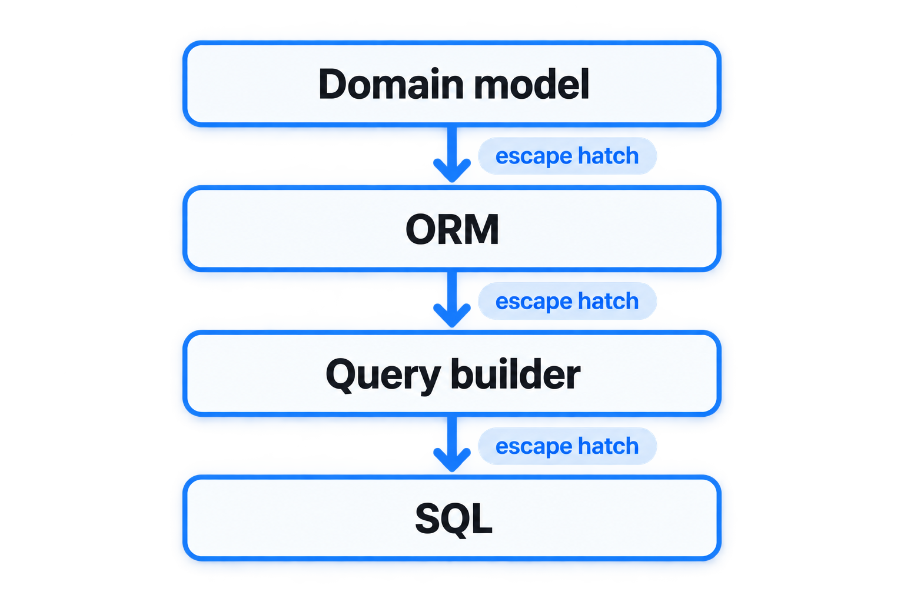

I like ORMs. Let's get that straight out of the way before we dive into the post.
I'm currently building a NestJS backend template using MikroORM and PostgreSQL, and for most ordinary application code it's exactly the kind of abstraction I want.

Give me entities, relationships, migrations, a unit of work and change tracking. Let me load an entity, change it and persist it without writing the same plumbing for the hundredth time. Absolutely lovely!

But there's one thing I don't want from an ORM: <br />
**I don't want it to pretend the database underneath it doesn't exist.**

And increasingly, I don't think the choice is really between "ORM" and "SQL" anyway.
There are roughly three levels I tend to work at:

- an ORM, when I'm working with entities and domain state;
- a query builder, when I'm asking the database more interesting questions;
- raw SQL, when I actually need it.

I heavily favour the first two. <br />
But whichever abstraction I choose, I want an escape hatch to the level below it.

## ORMs solve a real problem

Let's start with the easy one.
This is nice:

```typescript
const user = new User();
user.email = email;

em.persist(user);
await em.flush();
```

So is this:

```typescript
const order = await orders.findOneOrFail(id);
order.cancel();
await em.flush();
```

There's a lot happening here.
The ORM knows how my entities map to tables. It understands relationships. It tracks changes. It manages an identity map and an unit of work. It can participate in transactions and turn database rows back into the objects my application works with.

For applications with a meaningful domain model, that's genuinely useful.
I don't want to replace all of that with SQL.

The problems usually start when we try to make the ORM responsible for *every* interaction with the database.

## Sometimes I'm not loading an object

Suppose I'm building a dashboard. I want the twenty customers with the highest revenue over the last thirty days.
Conceptually, that's something like:

```sql
SELECT
    customer_id,
    COUNT(*) AS order_count,
    SUM(total) AS revenue
FROM orders
WHERE created_at >= $1
GROUP BY customer_id
ORDER BY revenue DESC
LIMIT 20;
```

I'm not really loading an `Order`.
I'm asking the database a question.

I don't need change tracking. I don't need an identity map. I don't particularly want to instantiate hundreds of domain objects just so I can immediately aggregate them into something else.

And the result isn't an entity either.

It's a read model:

```typescript
interface CustomerRevenue {
    customerId: string;
    orderCount: number;
    revenue: number;
}
```

This is where I increasingly prefer a query builder.

## Query builders are a very comfortable middle ground

A query builder like Kysely doesn't try to make the relational model disappear.
That's precisely what I like about it.

The previous query can remain recognisably SQL:

```typescript
const customers = await db
    .selectFrom('orders')
    .select('customer_id as customerId')
    .select(({ fn }) => [
        fn.countAll().as('orderCount'),
        fn.sum('total').as('revenue'),
    ])
    .where('created_at', '>=', thirtyDaysAgo)
    .groupBy('customer_id')
    .orderBy('revenue', 'desc')
    .limit(20)
    .execute();
```

I still think in tables, joins, predicates, grouping and ordering.
The query builder gives me composition, parameterisation and, especially in TypeScript, excellent type information around that SQL.

It doesn't ask me to forget SQL.
It helps me write it.
That's **the** distinction I care about.

## SQL knowledge is an asset, not legacy baggage

I got a particularly good demonstration of this at work.

We have a team working on a Business Integration Platform. A large part of their job involves moving, transforming and integrating data between systems.

The developers originally came from a Sybase background.

When we started modernising that platform, there were a lot of things we wanted to change. We moved towards PostgreSQL with Supabase, TypeScript, Edge Functions and a much more modern development and deployment model.

I could have put a large ORM in front of the new database and told everyone to start thinking in entities instead.
Technically, that would have been modernisation too.
But it would also have thrown away one of the team's most valuable skills.

**They knew SQL.**

They knew relational databases. They knew joins, grouping, filtering and how to reason about data.
Changing technology doesn't suddenly make that knowledge obsolete.
So I deliberately chose Kysely for database access.

That gave us an interesting bridge. The database changed from Sybase to PostgreSQL, the application language moved towards TypeScript, and the runtime and deployment model changed. But the team's existing understanding of relational databases still applied.

They could learn TypeScript gradually while continuing to solve database problems in a way they already understood.

**And TypeScript gave something back.**

With Kysely, the compiler knows quite a lot about the database model. Queries become typed, autocomplete becomes useful and refactoring becomes safer, while the code still looks and behaves like the SQL the team understands.

For an integration platform in particular, that has turned out to be a very natural fit. In the end the developers that had been working more on legacy systems fell in love with the autocomplete for the "SQL" they were writing, since they'd never had that before.

### Modernisation doesn't mean starting over

I think there's a broader engineering lesson in that.

When modernising a system, it's tempting to look only at the technology you want to end up with.
What's the modern framework? What's the modern database? What's the architecture we want? What's the stack we'd choose if we were starting from scratch?

Those are useful questions, but you're usually not starting from scratch. You already have a team, and that team has knowledge.
Some of it will be tied to technologies you're replacing, but a lot of the core concepts won't be.

The Sybase-specific knowledge mattered less to me than the years of experience underneath it. These developers understood relational data and SQL. Putting an ORM between them and PostgreSQL wouldn't have made the platform more modern. It would mostly have hidden the thing they already understood best while asking them to learn everything else at the same time.

Kysely gave us a way to change the stack without resetting the team to zero.
That's something I think we sometimes miss in technical migrations. even though it's really powerful if you can leverage exactly that.

> The best migration path isn't necessarily the one with the cleanest end-state architecture. It's the one that gets the system and the people there successfully.

Maybe we'll eventually introduce an ORM for parts of that system too.
If we start building richer domain behaviour, I can absolutely see value in doing that.
But I wouldn't want the ORM to replace Kysely.

I'd want it alongside it.

## Different problems deserve different abstractions

This is where I've ended up mentally separating the three approaches.

### ORM: I'm working with domain state

If I'm loading an aggregate, applying behaviour and persisting the result, an ORM is usually where I want to be.

```typescript
const order = await orders.findOneOrFail(id);

order.addItem(product, quantity);
order.recalculate();

await em.flush();
```

The abstraction matches the problem.
I'm thinking about an order, not an `orders` table.
That's exactly what the ORM should give me.

### Query builder: I'm asking the database a question

Reporting is the obvious example, but it's not the only one.

Aggregations, projections, bulk operations, complicated joins, integration queries and purpose-built read models often fit naturally here.

```typescript
const result = await db
    .selectFrom('orders as o')
    .innerJoin('customers as c', 'c.id', 'o.customer_id')
    .select([
        'c.id',
        'c.name',
    ])
    .select(({ fn }) =>
        fn.sum('o.total').as('revenue')
    )
    .where('o.created_at', '>=', thirtyDaysAgo)
    .groupBy(['c.id', 'c.name'])
    .execute();
```

I can see what the database is being asked to do.
I get most of the advantages I'd want over writing a SQL string manually.

And I'm not trying to convince an object abstraction to express a fundamentally relational operation.
For a lot of view-heavy backend work, this is probably my favourite level.

### Raw SQL: when SQL itself is the clearest tool

And then there is raw SQL. Which I almost never use (in code..) nowadays.
Modern query builders are good enough that I rarely find myself wanting an entire application query written as a raw string.

Kysely in particular gets me close enough to SQL that there usually isn't much reason to give up its type safety, composition and parameterisation.

But I still want the option.

Sometimes there's a PostgreSQL-specific feature that the builder doesn't support nicely yet. Sometimes a particularly unusual query is simply clearer when written directly. Sometimes I'm using a database extension or expression where forcing it through another API makes the result harder to understand rather than easier.

At that point:

```typescript
sql`
    ...
`
```

or the equivalent escape hatch is completely reasonable.

The escape hatch isn't free, though, and it's worth being honest about that. Dropping to raw SQL steps around the parts of the ORM that were quietly protecting me: change tracking, the identity map, entity validation and the unit of work. A hand-written statement can mutate rows the ORM still believes it knows, leave a stale cache behind, or silently drift when a later migration renames a column the string still references. Those are real costs, and they're precisely why I want this at the bottom rather than scattered through everyday code.

Raw SQL isn't my preferred starting point anymore.
It's the bottom escape hatch, used deliberately and sparingly.

And I want it to stay there.

## Even my query builder needs an escape hatch

This is an important part of the argument. I'm not asking ORMs to provide an escape hatch because query builders are somehow complete. They aren't, and I want the same thing from a query builder.

If PostgreSQL has a feature that my query builder can't express cleanly, I don't want the capabilities of my database to be limited by the capabilities of a library. I want to be able to drop down one level.

That's why I increasingly think about database tooling as layers rather than competing camps.



You don't necessarily travel through every layer for every operation. And lower doesn't mean better.

The goal isn't to get as close to PostgreSQL as possible. The goal is to use the most useful abstraction for the problem while retaining access to the layer underneath it.

If you want to set a goal at all, the goal should be to end up as "high" in the tree as possible, whilst not having to work around anything. If the ORM can do it nicely, let the ORM do it. But don't fetch 1000 entities to aggregate on a single property for a dashboard view. The next chapter will dive deeper into this exact challenge.

## The abstraction becomes a problem when you start fighting it

This is the smell I look for.

You're trying to write a query. The database can express it quite elegantly, but your ORM can't.

So the query slowly turns into an impressive collection of nested framework methods, special operators and workarounds. Or it becomes several queries. Or, worse, you pull a pile of data into application memory and finish the job there.

At some point someone needs to ask:

> Are we solving the database problem, or are we solving the ORM problem?

I've seen developers go surprisingly far (especially in EntityFramework!) to avoid leaving an abstraction. But abstractions are supposed to make our jobs easier, and when you're fighting one, use the escape hatch.

## This doesn't make ORMs bad

Quite the opposite.

The ORM I'm currently using, MikroORM, is interesting precisely because it doesn't force this choice. I can use the high-level entity APIs for normal domain persistence, reach for MikroORM's own query builder when I need more control, and (in v7, which builds on and executes through Kysely) drop to the Kysely instance underneath via `em.getKysely()` or execute SQL directly when I want to go further.

That's much closer to what I want from an ORM. It gives me progressively lower-level tools rather than insisting that everything looks like an entity operation.

That also makes the decision much less ideological. I don't need to choose whether my application is an "ORM application" or a "Kysely application". I can choose the appropriate abstraction for each persistence problem.

## Database portability is usually overrated

One argument for staying entirely inside an ORM is portability. In theory, if we stick to the abstraction, we can replace PostgreSQL with MySQL or another database later.

There are certainly systems where that's valuable. But I think we often pay far too much for hypothetical portability.

Once an application starts making meaningful use of PostgreSQL, the database is already part of the architecture. Maybe we're using JSONB, partial or expression indexes, `SKIP LOCKED`, or PostGIS.

At that point, deliberately avoiding useful PostgreSQL features because we *might* replace PostgreSQL someday is a strange trade. We're accepting limitations today to make a migration we may never perform slightly easier.

I'd rather make deliberate use of the database we've actually chosen.

## The generated SQL still matters

Even when I'm entirely inside the ORM, I want to know what it's doing.

An innocent relationship can cause additional queries. A convenient abstraction can generate an expensive join. Loading an entity graph can fetch far more data than the endpoint actually needs. Pagination behaviour depends heavily on the generated query and the indexes available to support it.

Eventually, PostgreSQL executes SQL.
So when something matters for performance, I want to see that SQL. And eventually I probably want to see:

```sql
EXPLAIN ANALYZE ...
```

An ORM should reduce how much SQL I have to write. It shouldn't make SQL something I no longer understand.

## Pick the highest abstraction that still fits

That's generally my rule, in this case for databases but it applies more broadly.

> Use the highest-level abstraction that expresses the operation naturally.

If I'm manipulating domain state, that's often an ORM. If I'm querying and transforming relational data for a view, that's often a query builder. If the query builder gets in the way, I'll write SQL.

I don't think one of these needs to win. In fact, the libraries I increasingly like are the ones that don't force me to choose.

Make the common case pleasant.
Make the complicated case possible.
And always let me reach the database underneath.
