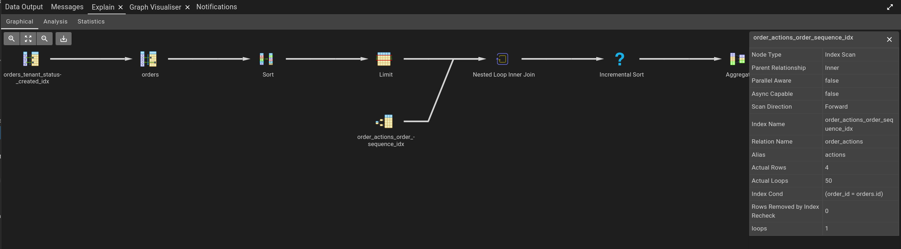

A team at work recently wanted to answer a very reasonable question:

**Will this GET endpoint still feel snappy when one tenant has 100k orders?**

That is a good question. It is exactly the kind of question teams should ask before users start complaining that an overview screen feels slow.

The endpoint returns orders. Each order has several actions underneath it, things like pickup, load, drop, cool, heat, and whatever else the domain requires. So the question was not just "can we store 100k rows?". It was closer to: **can the API return the order data quickly when the database contains a realistic amount of orders and actions?**

The part that made me twitch was the proposed setup.

Instead of preparing the database with the shape and volume needed for the test, the idea was to reuse the environment seeding scripts. Those scripts do far more than create orders however. They move through registration flows, trigger asynchronous events, touch Kafka, involve multiple services, and test a large part of the system as a side effect.

That might be useful for a different test.
It is not a good way to answer whether one GET endpoint is fast.

## Test scope matters

Performance tests are only useful when the scope matches the question. <br />
If the question is:

**Is order creation through the full distributed workflow reliable?**

Then yes, you probably need the services, the events, the handlers, the retries, and the "slow" boring reality of the full system.
But if the question is:

**Is this GET endpoint fast when there are 100k orders?**

Then dragging the whole write side of the system into the setup is unnecessary complexity.

You are no longer testing one thing. You are testing environment seeding, service availability, Kafka configuration, event handlers, registration flows, eventual consistency, database writes, and finally, if everything goes well, the GET query you cared about in the first place.

That is the wrong shape of test.

Not because those other parts do not matter, but because they do not answer this question.

## Start with the thing you actually need to know

For a GET endpoint, the first interesting question is usually the read path as a whole.

- Does the endpoint respond quickly enough?
- Where does the time go?
- Is the bottleneck the database, application code, serialization, authorization, or something else?
- Does the endpoint behave differently when the tenant has a realistic amount of data?

That is already enough to investigate. You do not need to create the data through 100s of endpoint calls or a full event-driven workflow just to get there.

*Start with the database state*. Create the shape of data the endpoint expects. Create enough of it. Then test through the application, using the telemetry you already have.

If the endpoint is slow, let the measurements tell you where to go next. Maybe you need to inspect the SQL. Maybe the mapping layer is the problem. Maybe serialization is expensive. Maybe the query is fine and the payload is just too large.

In contrast, testing the entire system right away removes that element of flexibility based on the data you've gathered so far. Backtracking on a mistake is easy and relatively cheap, exhausting possibilities is nearly always expensive.

## Volume is not enough

One trap with performance testing is thinking that "100k orders" is the full requirement.

***It is not. It never is.***

The shape of the data matters just as much as the amount.

100k empty orders without actions tell you very little if production orders usually have five, ten, or thirty actions. 100k orders with identical dates, statuses, and action types also tell you very little if the real query filters by those fields.

A useful dataset should be realistic enough to exercise the query including its parameters.
For an order endpoint, that might mean:

- 100k orders for the tenant being tested
- a realistic spread of statuses
- created dates across a useful time range
- multiple actions per order
- a mix of action types
- enough completed, active, and future orders to match real filtering behavior
- realistic text lengths for names, references, and locations

This does not need to be perfect however, as perfect test data is usually a trap of its own.
It **does** need to be representative of the parts of the data model that influence the endpoint / **current test**.

## Preparing the data

Postgres makes this kind of setup refreshingly simple.
Though pretty much every data storage solution offers something similar.

If the goal is to create enough data for a read-side performance test, a small SQL script is often enough. You can generate orders and actions directly with [`generate_series()`](https://www.postgresql.org/docs/current/functions-srf.html), keep the script versioned, and run it against a local, test, or performance database.

Something like this is enough to demonstrate the idea:

```sql
CREATE SCHEMA IF NOT EXISTS perf_test;

DROP TABLE IF EXISTS perf_test.order_actions;
DROP TABLE IF EXISTS perf_test.orders;

CREATE TABLE perf_test.orders (
  id bigint GENERATED ALWAYS AS IDENTITY PRIMARY KEY,
  tenant_id uuid NOT NULL,
  order_number text NOT NULL,
  status text NOT NULL,
  customer_reference text NOT NULL,
  created_at timestamptz NOT NULL,
  updated_at timestamptz NOT NULL
);

CREATE TABLE perf_test.order_actions (
  id bigint GENERATED ALWAYS AS IDENTITY PRIMARY KEY,
  order_id bigint NOT NULL REFERENCES perf_test.orders(id),
  action_type text NOT NULL,
  planned_at timestamptz NOT NULL,
  location_name text NOT NULL,
  sequence_number integer NOT NULL
);
```

Then seed the orders:

```sql
WITH tenant AS (
  SELECT '00000000-0000-0000-0000-000000000001'::uuid AS id
)
INSERT INTO perf_test.orders (
  tenant_id,
  order_number,
  status,
  customer_reference,
  created_at,
  updated_at
)
SELECT
  tenant.id,
  'ORD-' || lpad(series.order_index::text, 8, '0'),
  CASE series.order_index % 5
    WHEN 0 THEN 'created'
    WHEN 1 THEN 'planned'
    WHEN 2 THEN 'in_progress'
    WHEN 3 THEN 'completed'
    ELSE 'cancelled'
  END,
  'REF-' || md5(series.order_index::text),
  now() - ((series.order_index % 365) || ' days')::interval,
  now() - ((series.order_index % 30) || ' days')::interval
FROM tenant
CROSS JOIN generate_series(1, 100000) AS series(order_index);
```

And then add actions underneath those orders:

```sql
INSERT INTO perf_test.order_actions (
  order_id,
  action_type,
  planned_at,
  location_name,
  sequence_number
)
SELECT
  orders.id,
  CASE actions.sequence_number
    WHEN 1 THEN 'pickup'
    WHEN 2 THEN 'load'
    WHEN 3 THEN 'cool'
    WHEN 4 THEN 'heat'
    ELSE 'drop'
  END,
  orders.created_at + (actions.sequence_number || ' hours')::interval,
  'Location ' || ((orders.id + actions.sequence_number) % 5000),
  actions.sequence_number
FROM perf_test.orders orders
CROSS JOIN LATERAL generate_series(
  1,
  3 + (orders.id % 5)::integer
) AS actions(sequence_number);
```

That creates 100k orders and between three and seven actions per order.
Is this production data? No...
Is it enough to test whether a GET endpoint can handle a large tenant with a lot of child data? Possibly...

And, more importantly, it is cheap to change. If the real system usually has more actions per order, change the range. If the endpoint filters heavily on status, adjust the distribution. If the endpoint sorts by planned action date, make sure the action dates are shaped accordingly.

You are not waiting for a distributed workflow to eventually create the state you need. You are preparing the state directly so it can be fast & iterative.

That is the point.

## Test through the app first

Once the data exists, test the thing the user actually hits: the API.

Not through the entire order creation flow. Not through 100s of setup calls. Not by replaying every event that could eventually create the same state.

Call the GET endpoint against the prepared database and watch the telemetry you normally trust.

For example:

- request duration
- database call duration
- number of database calls
- payload size
- memory usage
- CPU usage
- serialization time if you can see it
- slow query logs if they are available

This keeps the test close to the real user path without dragging the whole platform into the setup.

At this point you are not trying to prove every technical detail. You are trying to answer the first practical question: **is the endpoint snappy with this amount and shape of data?**

If the answer is yes, you may already be done.

That is easy to forget. Not every performance test needs to turn into database archaeology or a load-testing project. Sometimes the endpoint is fine, the data shape is representative, and the useful conclusion is simply that the current design holds up for this scenario.

If the answer is no, the telemetry should tell you where to look next.

## If telemetry points at the database

If the endpoint is slow and the telemetry points at database time, then it makes sense to move down a layer.
This is where query-level testing becomes useful. Now you are not prematurely optimizing; you are following evidence.

Start by checking that the performance environment has the indexes the real endpoint should reasonably have.
For example:

```sql
CREATE INDEX orders_tenant_status_created_idx
  ON perf_test.orders (tenant_id, status, created_at DESC);

CREATE INDEX order_actions_order_sequence_idx
  ON perf_test.order_actions (order_id, sequence_number);

ANALYZE perf_test.orders;
ANALYZE perf_test.order_actions;
```

The exact indexes depend on the real query, so do not copy these blindly. The useful habit is to make indexes explicit when they are part of the endpoint's performance characteristics.

If the production endpoint relies on a specific index, the performance dataset should include it. If the endpoint is missing an index, the test should reveal that quickly.

This is also where `EXPLAIN (ANALYZE, BUFFERS)` becomes useful.
The query below shows you an example of how to explain/analyze a query for the use case:

*Fetch the latest 50 planned/in-progress orders for a tenant, and include each order's actions as an ordered JSON array.*

```sql
EXPLAIN (ANALYZE, BUFFERS)
WITH selected_orders AS (
  SELECT
    orders.id,
    orders.order_number,
    orders.status,
    orders.created_at
  FROM perf_test.orders orders
  WHERE orders.tenant_id = '00000000-0000-0000-0000-000000000001'
    AND orders.status IN ('planned', 'in_progress')
  ORDER BY orders.created_at DESC
  LIMIT 50
)
SELECT
  orders.id,
  orders.order_number,
  orders.status,
  orders.created_at,
  jsonb_agg(
    jsonb_build_object(
      'type', actions.action_type,
      'plannedAt', actions.planned_at,
      'location', actions.location_name
    )
    ORDER BY actions.sequence_number
  ) AS actions
FROM selected_orders orders
JOIN perf_test.order_actions actions
  ON actions.order_id = orders.id
GROUP BY
  orders.id,
  orders.order_number,
  orders.status,
  orders.created_at
ORDER BY orders.created_at DESC;
```

This tells you whether Postgres is doing roughly what you expect. Is it using the index? Is it scanning far too much? Is the join expensive? Is aggregation the bottleneck?

The graphical explain view in pgAdmin makes this a lot easier to scan when you are discussing the query with a team:



## If telemetry points at the application

If database time looks fine but the endpoint is still slow, stay in the application layer.

That might mean looking at the repository, query handler, controller, mapper, or whatever abstraction owns the read model. The important part is that you are still keeping the scope narrow.

At this layer you learn different things:

- Is the ORM generating the query you think it is generating?
- Are you accidentally loading far more data than needed?
- Are child collections causing extra queries?
- Is mapping expensive?
- Are you allocating too much memory?

This is where a query that looked fine in SQL can still become slow in application code.

Maybe the SQL takes 40ms, but the endpoint takes 900ms because it materializes a huge object graph before trimming it down. Maybe pagination happens in memory. Maybe serialization is doing more work than expected.

Those are useful discoveries.

And they are much easier to find when Kafka, registration flows, and half the platform are not running in the background.

## If you need repeatable pressure

If a few manual or automated endpoint calls show the path is basically healthy, but you still need to know how it behaves under repeated access, then a tool like [k6](https://k6.io/) can help.

Not because [k6](https://k6.io/) is magic, but because it gives you a simple way to apply repeatable pressure to the endpoint.

A tiny smoke-style script might look like this:

```js
import http from "k6/http";
import { check } from "k6";

export const options = {
  vus: 10,
  duration: "1m",
};

export default function () {
  const response = http.get(
    "https://api.example.test/orders?status=planned&pageSize=50",
    {
      headers: {
        Authorization: `Bearer ${__ENV.ACCESS_TOKEN}`,
      },
    },
  );

  check(response, {
    "status is 200": (result) => result.status === 200,
    "responds under 500ms": (result) => result.timings.duration < 500,
  });
}
```

For a real test you would tune this to match the expected usage pattern. Different filters. Different pages. Different sort orders. Maybe a short warm-up. Maybe a higher number of virtual users.

But again, the point is scope.

You are testing the GET endpoint against a prepared database state. You are not using the GET endpoint test to validate every path that could possibly create that state.

That difference matters a lot.

## What about different databases, like MongoDB?

The same principle applies to MongoDB, even though the mechanics are different.

With Mongo, for example, you still do not need to replay the whole system just to create read-side test data. You can bulk insert documents in the shape the endpoint reads.

The main differences are in how you think about the data.

In Postgres, you are usually preparing related tables: orders, actions, maybe addresses, maybe customers. You care about joins, indexes, grouping, and query plans.

In MongoDB, you first need to be clear about the document shape.

If actions are embedded inside the order document, your performance test should create 100k order documents with realistic action arrays. That tests document size, projection, filtering, sorting, and serialization.

If actions are stored separately and referenced by order id, your test needs both collections, and you need to test whatever lookup or second query the endpoint uses.

The Mongo version of this advice is:

- bulk insert the documents directly
- match the read model shape used by the endpoint
- create the indexes the query relies on
- use realistic array sizes for actions
- test the API on top of that prepared state
- check the query with `explain("executionStats")` if telemetry points at MongoDB

Mongo does not change the principle. It only changes the data preparation tool.

## The full system still matters

None of this means full-system tests are bad.

They are valuable. They catch wiring issues, contract mismatches, environment problems, event handling bugs, and real integration failures.

But they answer a different question.

- A full-system test tells you whether the system works together.
- A focused performance test tells you where a specific path bends or breaks under load.

Those are **both** useful, but they should not be confused.

When teams mix them together, the test becomes slow (especially setup!), fragile, expensive, and hard to interpret. If it fails, what failed? The endpoint? The seed process? A consumer? Kafka? Some unrelated registration service? A timeout in a dependency?

That is a bad feedback loop.<br />
The narrower test gives you faster learning.<br />
The broader test gives you confidence that the pieces still work together.<br />

You usually need both, but not at the same time and not for the same question.

## A better testing sequence

When I encounter a scenario similar to this I propose the following worflow order:

1. Define the exact performance question.
2. Prepare representative database data directly.
3. Test the HTTP endpoint through the application.
4. Use regular telemetry to see where the time goes.
5. If database time is the problem, inspect the query and indexes.
6. If application time is the problem, inspect mapping, object loading, authorization, and serialization.
7. If repeated access matters, add load with realistic request patterns.
8. Only broaden the system scope when the question requires it.

That last step is important.

Do not start broad and hope to find the answer somewhere in the noise. Start narrow, learn quickly, and widen the scope deliberately.

## Wrapping up

If you want to know whether a GET endpoint is fast with 100k orders, create 100k orders in the database and test the GET endpoint.

- Do not call 100s of endpoints to create the data.
- Do not spin up 100s of services unless the question actually requires them.
- Do not turn a read performance test into an accidental end-to-end test of your entire platform.

- Prepare the right data. Test the smallest useful scope. Let the measurements decide where you go next.
  Performance tests are engineering tools, not rituals. Their value comes from how clearly they answer a question.

Keeping the scope tight is faster, clearer, cheaper, and much easier to reason about. And if the endpoint does turn out to be slow, you will actually know where to look.
