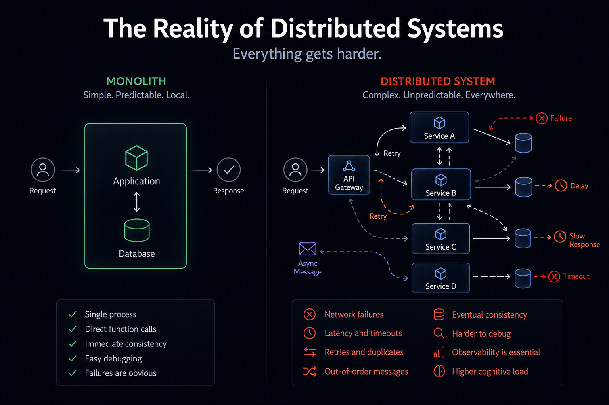

In the previous articles we explored how systems evolve, how they communicate, and where to draw boundaries. All of those decisions eventually lead to one moment:

The moment where your system is no longer a single unit.
The moment where it becomes distributed.

On paper, that often looks like progress. More scalable, more flexible, more future-proof.
That might well be true, but in practice, it is also the moment where everything gets harder.

## The moment things change

Moving to a distributed system does not feel like a big shift at first.
You extract a service. You move some logic out. You introduce an event or an API call. Everything still works. The system behaves roughly the same.

Until it doesn’t.

The difference is subtle, but fundamental. You are no longer working within a single process. You are working across network boundaries.
That means you are no longer dealing with function calls. You are dealing with unreliable communication.

And **that** changes everything.

## Debugging is no longer local

In a monolith, debugging is straightforward. Something goes wrong, you follow the stack trace, inspect the state, and you usually find your answer.

In a distributed system, there is no single place to look.
A request might start in one service, pass through two others, trigger an asynchronous process, and eventually fail somewhere completely unexpected. By the time you notice, the original context is gone.

Now you are searching across logs, correlating timestamps, and trying to reconstruct what actually happened.
This is where tools like tracing and telemetry become essential. Not because they are nice to have, but because without them, you are effectively blind.
Even with good tooling, it takes time to build the mental model needed to debug these systems.

I have seen this firsthand in every place I worked with a distributed system.

When new engineers join, especially those coming from more traditional or monolithic environments, this is one of the hardest things to teach. It is not just about reading logs, it is about understanding flows that are no longer linear.
We have had to invest in internal sessions, tooling like SigNoz, and shared practices just to get people comfortable with distributed debugging.

And even then, it takes time.

## Failure is everywhere

In a monolith, failure is usually binary. Something works, or it throws an error.

In a distributed system, failure is everywhere, and often partial.
A service might respond slowly. Another might time out. A third might process a message twice.
A fourth might never process it at all.
None of these are exceptional situations. They are normal.

This forces you to think differently..

- You need retries, but retries can cause duplicates.
- You need idempotency, but that adds complexity.
- You need timeouts, but choosing them is not trivial.

You are no longer designing for success. You are designing for failure.
And if you ignore that, your system will behave unpredictably under real-world conditions.

## Time becomes a problem

In a single system, time is mostly implicit. Operations happen in sequence. State changes are immediate.
In a distributed system, time becomes one of the hardest problems to reason about.
Messages can arrive out of order. Events can be delayed. Systems can temporarily disagree on what the current state is.

This is where eventual consistency stops being a nice concept and becomes a real constraint.
You might process an order, publish an event, and have another service react to it seconds later. Or minutes. Or after a retry.
If your system assumes everything is always in sync, it will break.

Designing for this means accepting that different parts of your system will see different realities at different times.
That is not a bug. That is the system working as designed.

## Observability is not optional

In a distributed system, logging alone is not enough.
You need to be able to answer questions like:

- Where did this request go?
- Which services were involved?
- Where did it slow down?
- Where did it fail?

This requires more than logs. It requires structured logging, tracing, correlation IDs, and metrics that actually tell a story.
Without that, you are guessing.
With it, you are still working, but at least you are working with context.

The difference between those two states is enormous.

## The team impact is real

This is where things often get underestimated.

Distributed systems are not just harder technically. They are harder for **teams**.
Not only does the context of the application become larger, and thus harder to grasp. But onboarding new members (or colleagues!) becomes more difficult. New engineers need to understand not just code, but interactions between multiple services, asynchronous flows, and failure scenarios.

We have seen this very clearly.

As our system evolved, we had to adjust how we hire and onboard at Frontliners. It was no longer enough to look for someone who knew the stack. We needed people who could adapt, reason about systems, and build a mental model of something that is not immediately visible.

We also had to upskill existing teams.
For example, engineers coming from environments like Clarion or ASP.NET had to learn not just a new language like TypeScript, but a completely different way of thinking about systems. Distributed debugging, eventual consistency, and asynchronous flows are not things you pick up overnight.

This takes _deliberate_ effort.

Training, internal sessions, shared knowledge, and a culture where asking questions is encouraged all become essential.

## The trap

One of the biggest traps in architecture is underestimating this shift.
It is easy to say “we will figure it out later” or “we will add retries” or “we will just log everything”.

These are not solutions. They are placeholders.

- Adding retries without thinking about idempotency creates duplicate processing.
- Logging everything without structure creates noise, not insight.
- Ignoring failure modes works, until it doesn’t.

Another common trap is distributing too early.
If your system does not yet need the benefits of distribution, you are taking on complexity without getting much in return.
Simplicity is still a valid choice.

Just like with the modular monolith, starting simple is often the right move. If you reach a point where that simplicity becomes a bottleneck, that is a good problem to have.

But if you start complex, you are committing to a problem space that requires experience, discipline, and tooling to handle well. I'm not saying you shouldn't... your situation might require it. But best be prepared!

## Visualising the difference

## A grounded takeaway

Distributed systems are powerful. **Very** powerful.  
They allow you to scale, to decouple, and to build systems that can evolve independently.

But they demand more from you.

- More discipline.
- More awareness.
- More investment in tooling and people.

They are not something you casually adopt.
If you are not ready to deal with failure, time, and complexity as first-class concerns, you are better off staying simple for a little longer.
And that is not a step back. That is a conscious decision.

## Wrapping up

Moving to a distributed system is not just a technical change. It is a shift in how you think about software.

- You stop assuming things will work, and start designing for when they don’t.
- You stop relying on immediate consistency, and start working with eventual outcomes.
- You stop debugging locally, and start reasoning about flows.

That shift takes time.
It takes experience.
And it takes a willingness to accept that things are no longer simple.
