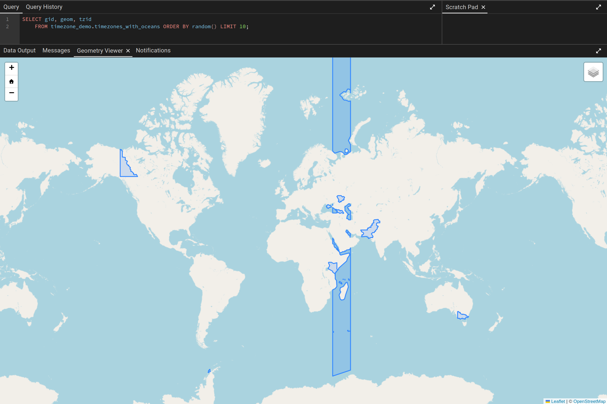

This week I ran into a problem at work that sounds trivial until you stare at it for a minute. We are integrating with a supplier that sends us chat messages from drivers to planners. Every message has a timestamp. Most of them even have an offset. None of them have a timezone.

That distinction matters more than it looks.

We run into timezone discussions a lot. Most of the systems we integrate with were originally designed for local use cases - one country, one zone, problem solved. We are building global, and that shift in mindset (and tech) drags every old assumption into the light. Offsets vs zones is the one that keeps coming back.

If everyone involved lives in the same zone, an offset is "good enough", you can shove the value into a `timestamptz`, render it back, and call it a day. Our planners do not live in that world. They sit in offices in the Netherlands and route trucks across Europe, into the UK, and often further out in the world. A driver pings in from somewhere near Krakow at `14:32:00+02:00` and a planner in Amsterdam wants to know two things: when did this happen in *my* time, and when did this happen in *their* time. The second question can not be answered with an offset alone.

The fix needs to be "cheap". We're integrating with Supabase edge functions and those have limited CPU time.
So integrating with a paid maps provider (which we have) and introducing a lengthy HTTP call is doable, but spends a lot of time on overhead we do not need. I've solved similar issues in the past and I advised the team to go with a shapefile and PostGIS.
I then built this small playground to show a few colleagues how it works, because the problem feels much bigger than it is until you see the query.

## Why an offset is not a timezone

This question is what you get most, with "let's just do everything in UTC" as a close second. Both are not ideal.
`+02:00` tells you the wall-clock distance from UTC at one specific instant. It tells you nothing about:

- whether DST is in effect (the same place is `+01:00` in winter and `+02:00` in summer)
- what the rules are going forward (`Europe/Amsterdam` and `Europe/Berlin` happen to agree today, but politically that is not guaranteed forever)
- what the location *is called*, which is what a human actually wants to read

None of those are solved by UTC either, with UTC you're essentially taking today's truth (DST and all) and forever encoding it in the timestamp, permanently removing the actual offset *and* the zone info.

The IANA timezone strings (the `Europe/Amsterdam`, `America/New_York`, `Pacific/Auckland`), do however encode all of that. An offset, or worse: UTC, throws it away.

So the actual ingestion problem is that when you are given a payload like:

```json
{
  "event_type": "Driver location",
  "eventdatetime": "2026-06-02T14:32:00+02:00",
  "latitude": 50.0614,
  "longitude": 19.9366
}
```

how do we attach `Europe/Warsaw` to it before it lands in our database?

The answer we landed on: a point-in-polygon lookup against a shapefile of the world's timezones. Which is exactly the kind of thing PostGIS was built for.

## The setup

I wanted a throwaway environment to play in. Just Postgres with PostGIS, a polygon dataset, and a SQL prompt. No production data, no shared dev cluster, nothing I would feel guilty about dropping.
I tend to take this approach when I am demoing some capabilities to our developers who then have to take this and apply it in their problem domain.
It makes it easy for me to work on multiple things and it makes it trivial for them to replicate my examples.

A small `compose.yml` does the job:

```yaml
name: postgres-playground

services:
  postgres:
    image: postgis/postgis:16-3.4
    restart: unless-stopped
    environment:
      POSTGRES_USER: playground
      POSTGRES_PASSWORD: playground
      POSTGRES_DB: playground
      TZ: Europe/Amsterdam
    ports:
      - "5435:5432"
    volumes:
      - ./data:/var/lib/postgresql/data
      - ./initdb:/docker-entrypoint-initdb.d:ro
```

The `initdb` folder gets a single SQL file that runs once on first boot:

```sql
-- initdb/01-extensions.sql
CREATE EXTENSION IF NOT EXISTS postgis;
CREATE EXTENSION IF NOT EXISTS postgis_topology;

CREATE SCHEMA IF NOT EXISTS timezone_demo;
```

A dedicated schema keeps the demo objects out of `public` so the playground stays readable. That is it for plumbing. `docker compose up -d` and you have a Postgres database on [localhost:5435](http://localhost:5435) with PostGIS loaded and an empty `timezone_demo` schema waiting for data.

## Loading the timezone polygons

The dataset I want to use is the [Timezone Boundary Builder](https://github.com/evansiroky/timezone-boundary-builder), a community-maintained shapefile that covers the whole planet (oceans included) and labels every polygon with its IANA zone id. Recent releases are tagged `YYYYa`/`YYYYb`, for the demo I am using `2026b`.

To get a shapefile into Postgres you traditionally reach for either `shp2pgsql` (ships with PostGIS) or `ogr2ogr` (ships with GDAL). The `postgis/postgis` image does not actually expose `shp2pgsql` on its `PATH`, and installing the full `postgis` apt package on top is a heavy detour. `ogr2ogr` from a small GDAL image feels much nicer.

A short personal aside: I really do not like littering my host with random one-off binaries. `gdal-bin`, `shp2pgsql`, `postgresql-client`, ten others... they pile up, they drift, they end up in someone's `$PATH` causing a weird CI failure two years later. Docker is my favourite way to dodge that. Run the tool in a throwaway container, mount the data in, throw the container away. Your taste may differ however, and if you already have GDAL installed natively (or want to install it), by all means go that route instead.

Here is the docker-only flow. Download once, import once, both inside containers:

```bash
# Download + unzip the shapefile (cached locally)
mkdir -p .tz-shapefile && cd .tz-shapefile
docker run --rm -v "$PWD:/work" -w /work alpine:3.19 sh -c \
  "apk add --no-cache curl unzip >/dev/null && \
   curl -fSL -o tz.zip \
   https://github.com/evansiroky/timezone-boundary-builder/releases/download/2026b/timezones-with-oceans.shapefile.zip && \
   unzip -o tz.zip"
cd ..
```

```sh
# Import into Postgres via ogr2ogr
docker run --rm --network=host \
  -v "$PWD/.tz-shapefile:/data" \
  -e PGPASSWORD=playground \
  ghcr.io/osgeo/gdal:alpine-small-latest \
  ogr2ogr -overwrite -progress \
    -f PostgreSQL \
    "PG:host=127.0.0.1 port=5435 dbname=playground user=playground" \
    /data/combined-shapefile-with-oceans.shp \
    -nln timezone_demo.timezones_with_oceans \
    -nlt PROMOTE_TO_MULTI \
    -lco SCHEMA=timezone_demo \
    -lco GEOMETRY_NAME=geom \
    -lco FID=gid \
    -lco PRECISION=NO \
    -t_srs EPSG:4326
```

Two things worth flagging:

- `--network=host` is there because we are talking to a port published on the docker host from inside another container. Usually we'd use the compose network for this, or would go through `host.docker.internal` but I've been bitten by people using all sorts of weird docker hosts with different default configuration... so I use this to march the path of least resistance.
- `-nlt PROMOTE_TO_MULTI` exists because some entries in the shapefile are `Polygon` and others are `MultiPolygon`. Without this flag the first row defines the column type and the second row fails. Promoting everything to `MultiPolygon` sidesteps it.

When this finishes you have a `timezone_demo.timezones_with_oceans` table with ~440 rows. Each row has a `tzid` like `Europe/Amsterdam` and a `geom` of the polygon (or multipolygon) covering that zone, in EPSG:4326 (plain old WGS84 lat/lon).

## The query that does the real work

This is the bit that solves the work problem. Given a latitude and longitude, find which polygon it falls inside, and use that polygon's `tzid` to convert a UTC instant into local wall-clock time.

```sql
WITH supplier_message AS (
  SELECT
    'Driver location'::text       AS event_type,
    '2026-06-02 14:32:00+02'::timestamptz AS event_at,
    50.0614::double precision     AS lat,
    19.9366::double precision     AS lon
)
SELECT
  m.event_type,
  m.event_at                            AS event_at_utc,
  tz.tzid                               AS local_tzid,
  m.event_at AT TIME ZONE tz.tzid       AS event_at_local
FROM supplier_message m
JOIN timezone_demo.timezones_with_oceans tz
  ON ST_Intersects(tz.geom, ST_Point(m.lon, m.lat, 4326));
```

A few notes for anyone new to PostGIS:

- `ST_Point(lon, lat, 4326)` takes **longitude first**. Every PostGIS user trips on this exactly once.
- `4326` is the SRID for WGS84 - the same coordinate system GPS reports in, and the one we asked `ogr2ogr` to project the shapefile into. They line up, so no transformation is needed.
- `ST_Intersects` uses the spatial index PostGIS builds automatically on `geom`. Even with several hundred polygons and complex geometries, the lookup is sub-millisecond.
- `AT TIME ZONE tz.tzid` is plain Postgres, not PostGIS. Postgres ships with the IANA timezone database baked in (`pg_timezone_names`), so once you have the `tzid` string, conversion is free.

For the Krakow coordinate above, this returns:

| event_type      | event_at_utc           | local_tzid     | event_at_local        |
| --------------- | ---------------------- | -------------- | --------------------- |
| Driver location | 2026-06-02 12:32:00+00 | Europe/Warsaw  | 2026-06-02 14:32:00   |

In our world the interesting columns are `event_at` and `local_tzid`. This use-case emerges mostly in the B2B integration platform - the UI lives in our main TMS instead. Our job is to receive a message, enrich it, and forward it to the next hop with the timezone *attached*, so whatever the TMS does with it is correct. In 99% of cases that means the outgoing payload carries the ISO datetime plus the IANA string and we are done. `AT TIME ZONE` is a useful trick for local debugging and the occasional report, but day-to-day we just hand the `tzid` to the next system.

## What this does for ingestion

We do this enrichment **on the fly**, as messages come in. There is a fallback path, an HTTP call to a third-party maps provider that does effectively the same thing, but it costs real money per request and adds a network hop we would rather not depend on (limited serverless scopes). The PostGIS lookup runs locally in the same database the rest of the pipeline already talks to, in sub-millisecond time, and the only ongoing cost is keeping the shapefile up to date when a new `tzdata` release lands.

The shape of the pipeline:

1. Receive the supplier message. Store the raw payload somewhere durable.
2. On ingestion, run the lookup and attach two things to the event: the `timestamptz` (absolute instant) and the `tzid` (IANA string). Forward both on the outgoing message.
3. Fall back to the paid provider only when the PostGIS lookup fails: a coordinate outside any polygon, or no coordinate at all. Those should be rare; with the "with-oceans shapefile" a valid GPS point will always hit something.

The bigger point is that the timezone becomes a property of the *event*, captured at ingestion time, instead of something downstream systems try to reconstruct from an offset that has already lost the information. Downstream code stops guessing, the next system in the chain gets a complete picture, and when a country changes its DST rules we get the right answer on day one because `tzdata` will know about it before our code does.

## What I left out

In my local demo I used pgAdmin to query and visualize the data. I know it's old-skool but I like it!
It's got a neat Geometry Viewer built-in that we can use to visualize the `geom` columns:



This little query shows exactly how weird some timezone polygons can be. If you want to play with it, here is the query:

```SQL
SELECT gid, geom, tzid
 FROM timezone_demo.timezones_with_oceans ORDER BY random() LIMIT 20;
```

in pgAdmin you can simply click the little visualize icon next to the column name to get a leaflet-based map.

## tl;dr

- A datetime with an offset is not a timezone. For users who care about location context, you need the IANA zone id.
- The Timezone Boundary Builder shapefile + PostGIS gives you (lat, lon) -> `tzid` in one `JOIN`.
- Running it locally is dramatically cheaper than a paid maps API and fast enough to do on every message.
- Capture the `tzid` once, at ingestion, and forward it. The rest of the chain stops guessing.
